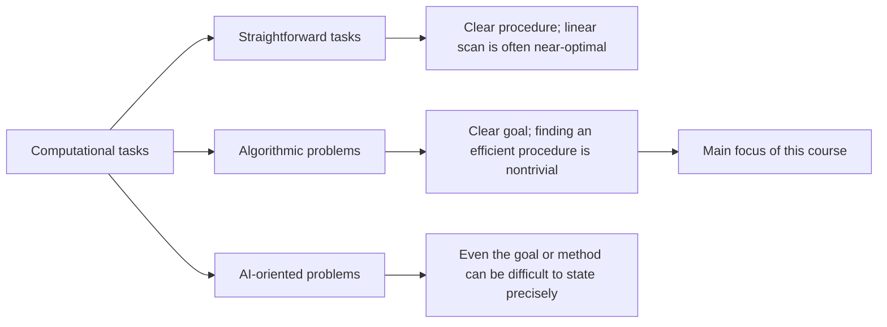

# Why Study Algorithms?

## Lecture purpose

Daniel Kane opens the Data Structures and Algorithms Specialization by asking why algorithms need to be studied in the first place. The lecture explains:

- what kinds of problems an algorithms course studies;
- why those problems matter;
- which programming tasks usually do **not** require sophisticated algorithmic techniques; and
- which problems go beyond the main scope of this course.

The course will focus on problems that can be formulated clearly but are still nontrivial to solve quickly and efficiently.

## 1. Straightforward programming tasks

Many tasks in a computer program do not require much algorithmic thought. Examples include:

- displaying given text on a screen;
- copying a file from one location to another; and
- searching a file for a particular word.

These tasks essentially require a **linear scan**: process the data one item or word at a time and perform the appropriate action. In many such problems, every piece of data must be examined, so there is little opportunity to do substantially better than the obvious method.

For this category of problem:

1. The obvious approach produces a working program.
2. The program solves the required problem.
3. Its efficiency is already close to the best one could reasonably expect.

Therefore, choosing an algorithm for these tasks may require relatively little thought.

## 2. Genuine algorithmic problems

Other problems are much less straightforward. Examples include:

- finding the shortest path between two locations on a map;
- finding the best assignment of students to dorm rooms using their preferences; and
- measuring the similarity between two documents.

For these problems, it is not immediately clear what procedure should be used. Even when a simple solution can be found, that solution is often far too slow.

For example, a program could try **every possible pairing** of students and dorm rooms and then return the pairing that optimizes the desired objective. Although this is a valid algorithm in principle, examining all possible pairings would probably take an extremely long time. A correct algorithm is not practically useful if there is not enough time to wait for it to finish.

This creates a need for better algorithms. Moreover, finding a reasonably efficient algorithm may not be the end of the work: there can still be considerable room for optimization. An improvement might reduce the running time:

- from one day to one hour;
- from one hour to one minute; or
- from one minute to one second.

Each improvement can greatly affect how useful the resulting program is.

## 3. Problems beyond the main scope of the course

Some tasks go beyond the kinds of algorithmic problems emphasized in this course. These may be called **artificial intelligence problems**. Their main difficulty is often not merely performing a known computation quickly; it is stating precisely what the computer is supposed to do and determining how to approach it.

### Understanding natural language

Suppose a user types an English question such as, “What is the price of milk at the local food store today?” A useful program would need to:

1. receive the sentence;
2. parse it and determine its meaning;
3. decide what information must be looked up;
4. perform that lookup; and
5. return a useful answer.

None of the individual operations is necessarily the central difficulty. The deeper problem is that people do not fundamentally understand language interpretation well enough to express the entire process in language precise enough to translate directly into a computer program. People can speak and understand English, but describing exactly what “understanding” an English sentence means is difficult.

### Identifying objects in images

Another example is asking a computer to identify the objects in a photograph—perhaps a dog, a tree, and a cloud. Human brains are very good at this, and people understand the question. However, it is hard to explain precisely how one recognizes one region as a dog and another as a tree. That makes it difficult to teach a computer to perform the same task.

### Playing games well

A further example is teaching a computer to play a game such as chess effectively. It is possible to recognize broadly what successful play means, but deciding exactly how to achieve it involves many vague and intuitive considerations. In this sense, the problem is not as cleanly defined as the mathematical problems at the center of the course.

### Relationship between AI and algorithms

These AI-oriented topics are not the course's main subject. The course concentrates on algorithms: how to carry out clearly stated tasks quickly and efficiently.

Nevertheless, a strong foundation in algorithms is important for AI. Once there is an idea of what it means, for example, to identify a tree in an image, algorithmic knowledge helps determine:

- what procedures could support that idea;
- which ideas can actually be implemented; and
- which implementations can run in a reasonable amount of time.

## 4. The kind of problems this course studies

The course focuses on **cleanly formulated problems**, often expressible as clear mathematical problems, whose solutions are still nontrivial.

A real-world problem may not initially look mathematical. For example, “find the shortest route between two points on a map” can be reformulated precisely:

- choose a sequence of intersections leading from the starting point to the destination;
- require every consecutive pair of intersections to be connected by a road; and
- minimize the sum of the lengths of those roads.

After this translation, the goal is unambiguous, but finding an efficient solution remains a meaningful challenge. This is the central kind of problem studied in the course.

By the end of the course, students should have a good understanding of how to solve such problems and how to write programs that solve them quickly and efficiently.

## 5. Why the first examples are Fibonacci numbers and GCD

The following two lectures begin with algorithms for:

- computing **Fibonacci numbers**; and
- computing **greatest common divisors (GCDs)**.

These may initially seem like unusual first examples. They are number-theoretic and numerical, and they are not especially similar to much of the material that comes later in the course. They were selected because they provide especially clear demonstrations of why algorithms are critically important.

Both problems have the same instructive pattern.

| Approach | How it is obtained | Correct? | Practical speed |
|---|---|---:|---|
| Straightforward algorithm | Translates the definition almost directly into code | Yes | May take thousands of years, even on modest inputs |
| Improved algorithm | Uses a slightly more complicated method and one or two key insights | Yes | Handles reasonable inputs in the blink of an eye |

### A direct algorithm is easy to obtain

Each problem has a straightforward algorithm that can be extracted almost immediately from its definition. One can interpret the words defining the problem as a procedure, turn that procedure into code, and obtain a program that works and computes the desired answer.

### The direct algorithm is far too slow

Despite being correct, the straightforward algorithm can be impractical. Even for modest inputs, it may require thousands of years to finish. A computation that takes millennia is not acceptable for practical purposes.

### A better algorithm makes an enormous difference

In both cases, a slightly more complicated method exists. It may require one or two important insights, but once developed, it is incredibly fast and can handle any reasonable problem instance in the blink of an eye.

These examples illustrate the central lesson of the lectures and of the course:

> Finding the right algorithm can make the difference between a computation that will not finish within a person's lifetime and one that finishes before the user notices it has started.

## Central takeaway

Studying algorithms is not merely about making small coding improvements. For many clearly defined computational problems, the choice of algorithm determines whether the problem can be solved in practice at all. The course therefore develops the ability to formulate problems precisely, find non-obvious solution strategies, and implement those strategies with enough efficiency to be genuinely useful.
