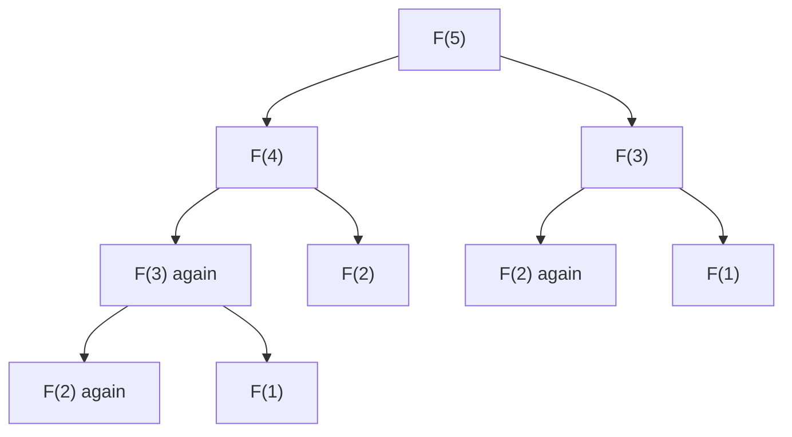

# Fibonacci Numbers: From a Naive Recursive Algorithm to a Fast Iterative Algorithm

## Learning goals

These lectures introduce the Fibonacci sequence, establish how quickly it grows, and use two algorithms for computing it to demonstrate why algorithm choice matters. After reading these notes, you should be able to:

- define the Fibonacci numbers;
- explain their original rabbit-population model;
- understand why Fibonacci numbers grow exponentially;
- write and analyze the direct recursive algorithm;
- identify repeated computation as the source of its poor performance; and
- write and analyze the efficient array-based iterative algorithm.

## 1. Definition of the Fibonacci sequence

The Fibonacci numbers are a classical sequence of natural numbers. They are defined recursively by

$$
F_0=0, \qquad F_1=1, \qquad F_n=F_{n-1}+F_{n-2}\quad\text{for }n\ge 2.
$$

Starting from 0 and 1, each new number is the sum of the previous two:

$$
0,\ 1,\ 1,\ 2,\ 3,\ 5,\ 8,\ 13,\ 21,\ 34,\ldots
$$

For example:

- $0+1=1$;
- $1+1=2$;
- $1+2=3$; and
- $2+3=5$.

The sequence is interesting both for its number-theoretic properties and for its history as a mathematical model.

## 2. The original rabbit-population model

The sequence was introduced to Europe by the Italian mathematician Fibonacci as a simplified model of rabbit population growth. The model assumes that:

1. a pair of rabbits takes one generation to mature; and
2. after maturing, each pair produces one new pair in every subsequent generation.

Under these idealized assumptions, the Fibonacci numbers describe the number of rabbit pairs after successive generations. Because rabbits reproduce quickly in the model, the resulting sequence also grows quickly.

## 3. Fibonacci numbers grow exponentially

For every $n\ge 6$, the lecture gives the lower bound

$$
F_n\ge 2^{n/2}.
$$

This can be proved by induction:

1. **Base cases:** directly compute $F_6$ and $F_7$ and verify that each is large enough.
2. **Inductive step:** use $F_n=F_{n-1}+F_{n-2}$, apply the inductive lower bounds to the two earlier terms, and simplify to obtain a value at least $2^{n/2}$.

Thus the number of digits—and the value of the number itself—rises rapidly with $n$.

With more work, one obtains the closed-form approximation

$$
F_n\approx \frac{\varphi^n}{\sqrt 5},
\qquad
\varphi=\frac{1+\sqrt 5}{2}.
$$

Because $\varphi>1$, this also shows exponential growth. Some example values from the lecture make the scale concrete:

| Index | Fibonacci number or scale |
|---:|---:|
| $20$ | $6{,}765$ |
| $50$ | $12{,}586{,}269{,}025$, approximately 12 billion |
| $100$ | $354{,}224{,}848{,}179{,}261{,}915{,}075$ |
| $500$ | An enormous number with roughly 100 digits (105 digits exactly) |

## 4. The computational problem

Whether Fibonacci numbers are being used for a population model or studied for their number-theoretic properties, the algorithmic task is:

> **Input:** a non-negative integer $n$  
> **Output:** the $n$th Fibonacci number $F_n$

The definition immediately suggests an algorithm—but correctness alone does not guarantee usefulness.

## 5. Naive recursive algorithm

The most direct solution translates the definition almost word for word:

```text
Fibonacci(n):
    if n <= 1:
        return n
    else:
        return Fibonacci(n - 1) + Fibonacci(n - 2)
```

If $n=0$, it returns 0. If $n=1$, it returns 1. Otherwise, it recursively computes the previous two Fibonacci numbers and returns their sum. It is a short, natural, and correct algorithm.

### Lecture cost model

To estimate its running time, let $T(n)$ be the number of lines of code executed on input $n$.

- If $n\le 1$, the algorithm checks the condition and executes the return statement, so $T(n)=2$.
- If $n\ge 2$, it executes three local lines and makes the two recursive calls.

Therefore,

$$
T(n)=
\begin{cases}
2, & n\le 1,\\
T(n-1)+T(n-2)+3, & n\ge 2.
\end{cases}
$$

This recurrence closely resembles the Fibonacci recurrence itself. In particular, it is easy to show that

$$
T(n)\ge F_n.
$$

The running time therefore grows at least exponentially. The lecture estimates

$$
T(100)\approx 1.77\times 10^{21}
$$

executed lines—about **1.77 sextillion**. Even a computer executing one billion lines per second (roughly the lecture's simplified 1 GHz model) would take approximately **56,000 years**. That is clearly unacceptable for computing a moderately indexed Fibonacci number.

### Why recursion becomes so slow

The issue is not recursion by itself; it is the enormous amount of **repeated computation**.



To compute $F_n$, the algorithm requests $F_{n-1}$ and $F_{n-2}$. Those calls request still earlier values, producing a large recursion tree. Within that tree:

- $F_{n-3}$ is computed three separate times;
- $F_{n-4}$ is computed five separate times; and
- lower values are recomputed more and more often as the tree expands.

Every recursive request starts its calculation again from scratch, including all of its own recursive descendants. Recomputing identical subproblems is what makes the algorithm extremely slow.

## 6. Efficient iterative algorithm

To find a better method, consider how a person writes the sequence by hand. Start with 0 and 1, then repeatedly add the last two values:

$$
0,1 \longrightarrow 1 \longrightarrow 2 \longrightarrow 3
\longrightarrow 5 \longrightarrow 8 \longrightarrow \cdots
$$

If all previously calculated values are stored, there is no need to rebuild them through recursive calls.

```text
FibonacciFast(n):
    create an array F[0..n]
    F[0] = 0
    F[1] = 1
    for i from 2 to n:
        F[i] = F[i - 1] + F[i - 2]
    return F[n]
```

The zeroth and first array entries establish the initial conditions. For each $i$ from 2 through $n$, the algorithm adds the two immediately preceding entries. After filling the list, it returns the final entry.

> **Boundary case:** in an implementation, handle $n=0$ before creating or assigning `F[1]`.

### Correctness idea

The array starts with the correct values $F_0=0$ and $F_1=1$. If the entries at positions $i-1$ and $i-2$ are correct, then assigning

$$
F[i]=F[i-1]+F[i-2]
$$

produces the correct $i$th Fibonacci number by definition. Repeating this argument establishes that the returned value is $F_n$.

### Running-time analysis used in the lecture

Under the lecture's simplified “lines executed” model:

- the fixed setup and return contribute four executed lines;
- the loop runs $n-1$ times; and
- each iteration contributes two executed lines.

This gives approximately

$$
T(n)=2n+2.
$$

For $n=100$, that is about **202 executed lines**, a tiny amount of work for a modern computer. In this model, computing the 100th, 1,000th, or 10,000th Fibonacci number is dramatically easier than with the naive recursion.

In asymptotic terms, the iterative algorithm uses $O(n)$ arithmetic operations and the array uses $O(n)$ stored values. Because the numbers themselves become very large, real implementations must also account for the growing cost of big-integer arithmetic; the lecture deliberately uses a simplified model to highlight the difference between exponential and linear numbers of algorithmic steps.

## 7. The complete contrast

| Property | Naive recursion | Iterative array method |
|---|---|---|
| Source | Direct translation of the definition | Mimics writing the sequence from left to right |
| Correct | Yes | Yes |
| Repeated work | Recomputes the same values many times | Computes each value once |
| Step growth | Exponential | Linear |
| Lecture estimate for $n=100$ | $1.77\times10^{21}$ lines; about 56,000 years at $10^9$ lines/s | About 202 executed lines |
| Practical lesson | Simple code may still be unusably slow | A small change in strategy can make large inputs manageable |

## 8. Central lesson

The naive algorithm is easy to derive and correct, yet it can take thousands of years on a modest input. The iterative algorithm is only slightly more thoughtful, but it completes in the blink of an eye under the lecture's cost model.

The difference is the choice of algorithm. In this example—and in many others—the right algorithm separates a computation that will not finish in a lifetime from one that finishes almost immediately. The next example in the course applies the same lesson to computing greatest common divisors.

## 9. Course resources and cautions

### Reading

- Computing Fibonacci numbers: Section 0.2 of *Algorithms* by Dasgupta, Papadimitriou, and Vazirani (DPV08).
- Advanced reading on Fibonacci properties: Exercises 0.2–0.4 in DPV08.

### Recursion refresher

If the recursive algorithm is difficult to follow, review the [Khan Academy section on recursive algorithms](https://www.khanacademy.org/computing/computer-science/algorithms/recursive-algorithms/a/recursion) from the algorithms course by Tom Cormen and Devin Balkcom.

### Interactive visualization

David Galles's [Computing Fibonacci Numbers visualization](http://www.cs.usfca.edu/~galles/visualization/DPFib.html) demonstrates the performance difference:

1. Enter `20`.
2. Select **Fibonacci Recursive** to observe the many recursive calls. Even at maximum animation speed, the visualization appears effectively endless; use **Skip Forward** to stop it.
3. Select **Fibonacci Table** to see the efficient array-based iterative algorithm.
4. The third option demonstrates recursion with **memoization**, which avoids repeated subproblems. Memoization is covered later in the Dynamic Programming module.

The visualization uses a different convention, $F_0=F_1=1$, whereas these lectures use $F_0=0$ and $F_1=1$. This changes the sequence values but does **not** affect the running-time comparison.

### Reference

Sanjoy Dasgupta, Christos Papadimitriou, and Umesh Vazirani. *Algorithms*, 1st edition. McGraw-Hill Higher Education, 2008.
