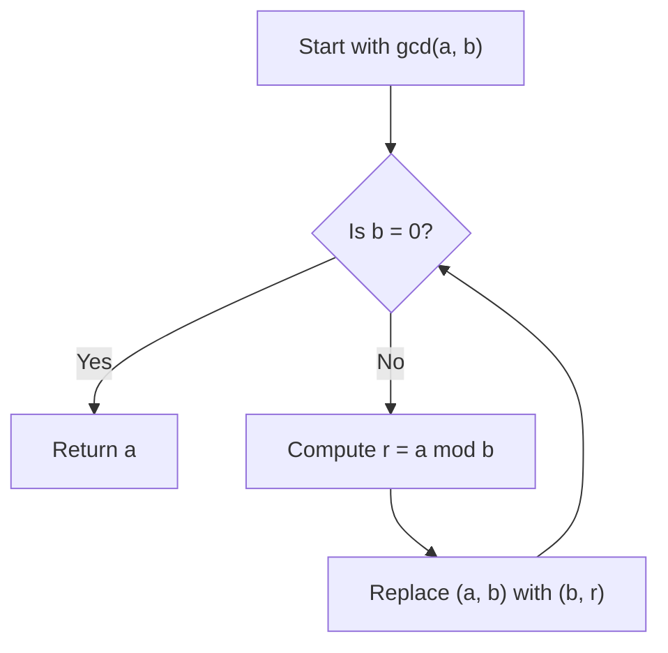

# Greatest Common Divisor: Naive Search and the Euclidean Algorithm

## Learning goals

These lectures use the greatest common divisor problem to reinforce a central theme of algorithm design: a definition may give an immediate correct algorithm, but solving the problem efficiently can require a deeper structural insight.

After reading these notes, you should be able to:

- define the greatest common divisor of two integers;
- describe and analyze the naive search algorithm;
- state and prove the key remainder lemma;
- apply the Euclidean algorithm by hand or in code;
- explain why the Euclidean algorithm terminates quickly; and
- compare the practical behavior of the two approaches.

## 1. The computational problem

For integers $a$ and $b$, a **common divisor** is an integer $d$ that divides both numbers. The **greatest common divisor**, written $\gcd(a,b)$, is the largest such integer.

The computational task is:

> **Input:** two integers $a$ and $b$  
> **Output:** the largest integer $d$ such that $d\mid a$ and $d\mid b$

The goal is not limited to small inputs. We want to compute GCDs quickly even when the inputs have 20, 50, 100, or 1,000 digits.

## 2. A naive algorithm derived from the definition

The definition suggests checking every possible candidate, remembering the largest candidate that divides both inputs.

```text
GCDNaive(a, b):
    best = 0
    for d from 1 to a + b:
        if d divides a and d divides b:
            best = d
    return best
```

The variable `best` stores the greatest common divisor found so far. Since $d$ increases throughout the loop, every newly discovered common divisor is larger than all previously discovered ones and becomes the new `best`. When the loop ends, `best` is returned.

The upper limit $a+b$ is certainly large enough to include all positive common divisors for positive $a$ and $b$. A tighter bound such as $\min(a,b)$ could be used, but it would not fix the algorithm's fundamental efficiency problem.

### Correctness

The algorithm is correct because it examines all possible common divisors within its search range. Whenever it encounters one, it records it. After all candidates have been examined, the stored value is the largest candidate dividing both $a$ and $b$.

### Running time

The loop executes $a+b$ times, so the number of iterations grows with the **values** of the inputs, not merely with the number of digits used to write them.

For 20-digit inputs, $a+b$ may be on the order of $10^{20}$. Iterating through that many candidates would already take at least thousands of years. The naive algorithm works, but it is inadequate for the intended applications.

## 3. The key lemma behind a faster algorithm

An efficient solution requires an important structural fact. Let $a'$ be the remainder when $a$ is divided by $b$. By the division algorithm,

$$
a=bq+a', \qquad 0\le a'<b,
$$

for some integer quotient $q$.

The key lemma is

$$
\gcd(a,b)=\gcd(a',b)=\gcd(b,a').
$$

In programming notation, $a'=a\bmod b$, so this is often written

$$
\gcd(a,b)=\gcd\bigl(b,a\bmod b\bigr).
$$

### Proof of the key lemma

The proof shows that $(a,b)$ and $(a',b)$ have exactly the same common divisors.

**Forward direction.** Suppose $d\mid a$ and $d\mid b$. Since

$$
a'=a-bq,
$$

$d$ also divides $a'$. Therefore, every common divisor of $a$ and $b$ is a common divisor of $a'$ and $b$.

**Reverse direction.** Suppose $d\mid a'$ and $d\mid b$. Since

$$
a=a'+bq,
$$

$d$ also divides $a$. Therefore, every common divisor of $a'$ and $b$ is a common divisor of $a$ and $b$.

The two pairs have identical sets of common divisors, so their greatest common divisors are equal. Reordering the pair does not change which numbers divide both elements, hence $\gcd(a',b)=\gcd(b,a')$.

## 4. The Euclidean algorithm

The key lemma replaces the original GCD problem with a smaller one. This gives the **Euclidean algorithm**:

```text
EuclidGCD(a, b):
    if b == 0:
        return a
    a_prime = a mod b
    return EuclidGCD(b, a_prime)
```

The two cases are:

- **Base case:** if $b=0$, return $a$. Every nonzero integer divides 0, so the greatest common divisor of $a$ and 0 is $a$ (assuming non-negative inputs).
- **Recursive case:** compute the remainder $a'=a\bmod b$ and recursively return $\gcd(b,a')$.

The key lemma proves that every recursive replacement preserves the answer. The remaining questions are whether the recursion terminates and whether it does so quickly.



## 5. Worked example

Compute

$$
\gcd(3{,}918{,}848,1{,}653{,}264).
$$

Repeated division with remainder gives:

| Step | Division equation | GCD reduction |
|---:|---|---|
| 1 | $3{,}918{,}848=2(1{,}653{,}264)+612{,}320$ | $\gcd(3{,}918{,}848,1{,}653{,}264)=\gcd(1{,}653{,}264,612{,}320)$ |
| 2 | $1{,}653{,}264=2(612{,}320)+428{,}624$ | $=\gcd(612{,}320,428{,}624)$ |
| 3 | $612{,}320=1(428{,}624)+183{,}696$ | $=\gcd(428{,}624,183{,}696)$ |
| 4 | $428{,}624=2(183{,}696)+61{,}232$ | $=\gcd(183{,}696,61{,}232)$ |
| 5 | $183{,}696=3(61{,}232)+0$ | $=\gcd(61{,}232,0)$ |

The second argument is now zero, so

$$
\boxed{\gcd(3{,}918{,}848,1{,}653{,}264)=61{,}232}.
$$

The lecture describes this as reaching the answer in six GCD states/steps, compared with checking roughly five million candidates using the naive approach.

## 6. Why the Euclidean algorithm terminates quickly

Each remainder satisfies

$$
0\le a\bmod b<b.
$$

Therefore, the second argument strictly decreases whenever it is nonzero, so the algorithm must eventually reach a remainder of 0 and terminate.

For the lecture's intuitive runtime explanation, the relevant number size falls by approximately a factor of 2 as the process advances. If each reduction halves the size, only logarithmically many reductions are required before the value becomes tiny or zero. The lecture summarizes the number of steps as approximately

$$
O(\log(ab)).
$$

This means that computing the GCD of two 100-digit numbers takes only about **600 division-with-remainder steps** under the lecture's estimate. A reasonable computer can perform that amount of work easily. Consequently, the Euclidean algorithm computes GCDs of very large integers quickly.

More formally, Euclid's algorithm has a logarithmic number of recursive iterations in the smaller input; consecutive Fibonacci numbers produce its well-known worst-case pattern. The lecture's $\log(ab)$ explanation is a convenient upper-level intuition for why the improvement is enormous.

## 7. Comparison of the algorithms

| Property | Naive candidate search | Euclidean algorithm |
|---|---|---|
| Main idea | Test possible divisors one by one | Repeatedly replace $(a,b)$ with $(b,a\bmod b)$ |
| Basis | Directly follows the GCD definition | Uses the key remainder lemma |
| Correct | Yes | Yes |
| Work for the example | Roughly 5 million candidate checks | Six GCD states / five remainder divisions |
| Behavior on very large inputs | Impractically slow | Very fast |
| Iteration growth | Proportional to numeric input values | Logarithmic number of reductions |

## 8. Central lessons

This example repeats the pattern seen with Fibonacci numbers:

1. A simple algorithm comes directly from the definition.
2. That algorithm is correct but far too slow for practical use.
3. A better algorithm makes large instances manageable.

The GCD example adds an important new lesson: finding a faster algorithm may require understanding something interesting about the problem's structure. The key lemma reveals that taking a remainder preserves all common divisors while replacing the problem with a smaller one.

This is a recurring theme throughout the course and the study of algorithms generally:

> Structural knowledge about a solution often makes it possible to simplify a computational problem dramatically.

The following lectures move from these examples to a more detailed study of how algorithm running times are calculated.

## 9. Course resources

### Reading

- Greatest common divisor: Section 1.2.3 of *Algorithms* by Dasgupta, Papadimitriou, and Vazirani (DPV08).
- Greatest common divisor: Section 31.2 of *Introduction to Algorithms* by Cormen, Leiserson, Rivest, and Stein (CLRS, 3rd edition).

### Additional help

If the lesson is difficult to follow, consult Khan Academy's elementary introduction to the greatest common divisor.

### References

- Sanjoy Dasgupta, Christos Papadimitriou, and Umesh Vazirani. *Algorithms*, 1st edition. McGraw-Hill Higher Education, 2008.
- Thomas H. Cormen, Charles E. Leiserson, Ronald L. Rivest, and Clifford Stein. *Introduction to Algorithms*, 3rd edition. MIT Press and McGraw-Hill, 2009.
