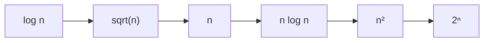
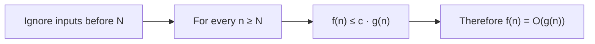

# Big-O Notation and Asymptotic Runtime Analysis

## Learning goals

This lecture sequence develops a practical way to describe algorithm efficiency without needing every hardware and implementation detail. After reading these notes, you should be able to:

- explain why source-code line counts and exact wall-clock time are poor general runtime measures;
- describe why asymptotic growth is useful;
- compare common growth rates;
- state and apply the formal definition of Big-O;
- simplify asymptotic expressions;
- analyze the bit-level runtime of the iterative Fibonacci algorithm; and
- distinguish $O$, $\Omega$, $\Theta$, and $o$ notation.

---

## Part I — Why measuring exact runtime is difficult

### 1. Reconsidering the “lines executed” model

Earlier lectures estimated runtime by counting executed lines of code. For the iterative Fibonacci algorithm, assuming an integer input $n\ge1$, that produced approximately $2n+2$ executed lines:

```text
Fibonacci(n):
    create array F[0..n]
    F[0] = 0
    F[1] = 1
    for i from 2 to n:
        F[i] = F[i - 1] + F[i - 2]
    return F[n]
```

Counting lines implicitly assumes that different lines represent comparable amounts of work. A closer examination shows that this is not true.

### 2. Different lines perform different amounts of work

#### Creating the array

Array initialization depends on the memory-management system. Fundamentally, the program must find enough memory and obtain a pointer to its first location. In practice, it might also need to:

- rearrange other allocations to make room;
- initialize bookkeeping information; or
- zero all entries so they do not contain old or meaningless data.

Depending on the environment, array creation may be quick or may require substantial work.

#### Assigning `F[0] = 0` and `F[1] = 1`

A source-level assignment can translate into several machine-level operations:

- load the array pointer;
- perform pointer or address arithmetic; and
- store the literal value at the correct memory location.

The second assignment requires similar work. Each source line is therefore not necessarily one machine operation.

#### Managing the loop

Every loop iteration may require the machine to:

- increment $i$;
- compare $i$ with $n$;
- decide whether the loop should continue; and
- branch to another instruction when the loop ends.

#### Adding two Fibonacci numbers

The update line requires two array lookups, pointer arithmetic, an addition, and a write to a third array position. More importantly, large Fibonacci numbers do not fit in a single fixed-size machine word.

Adding two large integers is not one elementary machine operation. The program must process multiple digits or machine words and propagate carries, so the addition becomes more expensive as the values grow.

#### Returning the answer

Returning `F[n]` involves an array lookup and address calculation. The return operation also interacts with the program stack, restoring the caller and passing back the result.

### 3. The problem with line counting

Although the sample program has only a few source lines, those lines perform very different amounts of work. A source-code line is therefore not a dependable universal unit of runtime.

### 4. Why not measure actual elapsed time?

The quantity we ultimately care about is the real time a program takes on an actual computer. Unfortunately, predicting that accurately requires many messy details.

| Factor | Why it affects runtime |
|---|---|
| Computer speed | A supercomputer and a phone execute the same work at different speeds. |
| System architecture | CPUs support different operations, and those operations have different relative costs. |
| Compiler | High-level C, Java, Python, or other code must be translated or executed; different compilers and runtimes apply different optimizations. |
| Memory hierarchy | Cache is fast, RAM is slower, and disk access can take milliseconds—an extremely long time at CPU scale. |
| Memory prediction and placement | Cache policies and predictions about future accesses affect which level serves a lookup. |

If the entire computation fits in cache, it may run quickly. Repeated RAM access is slower. If the program runs out of RAM and begins moving data to disk, it becomes dramatically slower.

All these factors interact. Worse, a program may run on many unknown users' computers, each with a different architecture, speed, compiler, and memory configuration. Computing a separate exact runtime for every client is not realistic.

### 5. What a useful replacement should provide

We need a runtime measure that:

- gives a meaningful efficiency estimate;
- avoids dependence on machine-specific details; and
- describes how runtime **scales with input size**, especially for large inputs such as millions of data points.

This motivates asymptotic analysis.

---

## Part II — The idea of asymptotic growth

### 6. Ignoring constant factors

Many implementation details change runtime by only a multiplicative constant:

- a machine 100 times faster reduces time by a factor of 100;
- multiplication taking three times as long as addition introduces a factor near 3 in multiplication-heavy code; and
- different memory levels can make accesses much slower, but by a hardware-dependent factor.

If runtimes $n$ and $100n$ are treated as having the same broad growth rate, these machine-specific details can largely be ignored.

### 7. Why ignoring constants alone is not enough

One second, one hour, and one year also differ only by constant factors; a year is roughly 30 million seconds. If all constants were ignored for a single fixed input, a one-second computation could appear equivalent to a one-year computation.

The solution is to avoid analyzing only one fixed input. Instead, asymptotic analysis asks:

> How does runtime change as the input size $n$ becomes very large?

Possible scaling behaviors include $n$, $n\log n$, $n^2$, and $2^n$. For sufficiently large $n$, differences between these growth functions exceed any fixed constant factor. For example, $1000n$ may initially exceed $n^2$, but once $n>1000$, $n^2$ is larger and continues to pull away.

### 8. Why growth rate matters in practice

Assume, for intuition, a computer can perform approximately $10^9$ basic operations per second:

| Approximate runtime | Largest input handled in about one second |
|---|---:|
| $n$ | $10^9$ (about one billion) |
| $n\log n$ | about $3\times10^7$ (30 million) |
| $n^2$ | about $3\times10^4$ (30,000) |
| $2^n$ | about $30$ |

For an exponential $2^n$ algorithm, input size 50 can already require about two weeks under the lecture's rough model, while size 100 is effectively impossible to finish. The distinction between linear, quadratic, and exponential growth is often far more consequential than a constant factor of 5 or 100.

### 9. Common growth-rate hierarchy

From slower growth to faster growth:

$$
\log n
\ll \sqrt n
\ll n
\ll n\log n
\ll n^2
\ll 2^n.
$$



At small inputs, graphs of these functions can cross or appear close together. As $n$ increases, they separate sharply:

- $2^n$ begins rising rapidly after small values and soon dominates everything else;
- $n^2$ becomes substantially larger than $n\log n$ and $n$;
- even $\sqrt n$ and $\log n$, which may initially look similar, separate substantially;
- for $n=1{,}000{,}000$, $\sqrt n=1{,}000$, while $\log_2n$ is approximately 20.

The central asymptotic question is not the exact time for one input, but how runtime scales as inputs become large.

---

## Part III — Formal Big-O notation

### 10. Definition

Throughout these notes, $f$ and $g$ are assumed to be eventually nonnegative runtime or growth functions. We say

$$
f(n)=O(g(n))
$$

if there are positive constants $c$ and $N$ such that

$$
f(n)\le c\,g(n)
\qquad\text{for every }n\ge N.
$$

In words: for all sufficiently large inputs, $f$ is bounded above by a fixed constant multiple of $g$.

> **Transcript correction:** the spoken transcript briefly says “$g(n)$ is Big-O of $g(n)$.” The intended definition, used throughout the explanation, is that **$f(n)$ is Big-O of $g(n)$**.



### 11. Example: $3n^2+5n+2=O(n^2)$

For every $n\ge1$,

$$
3n^2+5n+2
\le 3n^2+5n^2+2n^2
=10n^2.
$$

Thus the definition is satisfied with $c=10$ and $N=1$, proving

$$
3n^2+5n+2=O(n^2).
$$

The ratio

$$
\frac{3n^2+5n+2}{n^2}
=3+\frac5n+\frac2{n^2}
$$

approaches 3 as $n$ grows. The functions are not equal, but their large-input growth differs only by a bounded constant factor.

> **Transcript correction:** the lecture transcript says that $n^2$ is one million at $n=100$. In fact, $100^2=10{,}000$, and $3(100)^2+5(100)+2=30{,}502$. The intended point—that the ratio is a little above 3—remains correct.

### 12. Advantages of Big-O

#### It clarifies growth rate

Complicated exact expressions can make algorithm comparison difficult and input-dependent. Big-O emphasizes which algorithm eventually scales better for very large inputs.

#### It cleans up notation

Examples:

$$
3n^2+5n+2=O(n^2),
$$

$$
n+\log_2n+\sin n=O(n),
$$

and

$$
4n\log_2n+7=O(n\log n).
$$

The logarithm's base can be omitted because the change-of-base formula gives

$$
\log_a n=\frac{\log_b n}{\log_b a}.
$$

Different fixed bases therefore differ only by a constant multiple.

#### It simplifies algebra

Removing constant factors and lower-order terms produces expressions that are easier to manipulate.

#### It is largely machine-independent

Computer speed, compiler behavior, architecture, and memory hierarchy may significantly affect actual time, but the introductory RAM model generally treats their effect as a constant factor. Big-O analysis under this model deliberately ignores such factors; other models, such as external-memory analysis, may account for them explicitly.

### 13. Limitations and warnings

Big-O loses useful information.

#### Hidden constants matter

Two algorithms can share the same Big-O even if one is twice or 100 times faster. After selecting an algorithm with good asymptotic behavior, practical optimization may still need to:

- reduce constant factors;
- improve memory access patterns;
- interact better with caches and the memory hierarchy; and
- exploit machine- or compiler-specific behavior.

#### Big-O is asymptotic

Big-O describes sufficiently large inputs, not the exact time for a particular input. An algorithm with a better asymptotic bound can be slower for every practically representable input if its hidden constants or crossover threshold are enormous.

Usually the hidden constants are moderate, making Big-O informative, but this is not guaranteed. For realistic input sizes, an asymptotically worse algorithm may sometimes be the better practical choice.

Despite these limitations, Big-O is extremely useful and is the main notation used for runtimes throughout the course.

---

## Part IV — Using Big-O notation

### 14. Common simplification rules

#### Rule 1: omit multiplicative constants

$$
7n^3=O(n^3),
\qquad
\frac{n^2}{3}=O(n^2).
$$

Big-O was designed to ignore fixed multiplicative constants.

#### Rule 2: among powers of $n$, the larger exponent grows faster

$$
n=O(n^2),
\qquad
\sqrt n=O(n).
$$

#### Rule 3: every fixed-base exponential eventually outgrows every polynomial

For constants $k>0$ and $a>1$,

$$
n^k=O(a^n).
$$

Examples from the lecture include

$$
n^5=O\bigl((\sqrt2)^n\bigr)
$$

and

$$
n^{100}=O(1.1^n).
$$

The second relationship can feel surprising: $n^{100}$ is enormous while $1.1^n$ grows modestly at first. Nevertheless, the exponential eventually overtakes the polynomial once $n$ becomes sufficiently large—at about $n=9{,}624$ in this example. Afterward, it pulls ahead rapidly.

#### Rule 4: every fixed power of $\log n$ grows slower than every positive power of $n$

Examples:

$$
(\log n)^3=O(\sqrt n)
$$

and

$$
n\log n=O(n^2).
$$

#### Rule 5: in a sum of nonnegative terms, retain the fastest-growing term

$$
n^2+n=O(n^2),
$$

$$
2^n+n^9=O(2^n).
$$

For eventually nonnegative terms, lower-order terms become insignificant relative to the dominant term as $n$ grows.

### 15. Analyzing the iterative Fibonacci algorithm

Revisit the array-based algorithm, again assuming $n\ge1$:

```text
Fibonacci(n):
    create array F[0..n]
    F[0] = 0
    F[1] = 1
    for i from 2 to n:
        F[i] = F[i - 1] + F[i - 2]
    return F[n]
```

The analysis examines each operation rather than treating every source line equally.

#### Array creation: $O(n)$

Ignoring complicated allocation issues, suppose the runtime zeros all $n+1$ cells. Each cell requires a constant amount of work—such as a write, counter increment, and comparison—so initialization takes $O(n)$ time.

#### Initial assignments: $O(1)$ each

Setting `F[0]` and `F[1]` may require several machine operations, but the number does not grow with $n$. Each assignment is therefore $O(1)$.

#### Number of loop iterations: $O(n)$

The loop runs from 2 through $n$, for $n-1$ iterations, which is $O(n)$.

#### Work in iteration $i$: $\Theta(i)$ under the lecture's large-integer model

Array lookups and the store are treated as $O(1)$. The addition is not constant-time because the Fibonacci values are large.

The value $F_i$ has $\Theta(i)$ bits and a number of decimal digits proportional to $i$—roughly $0.209i$, which the lecture rounds to about $i/5$. Grade-school addition must process these bits or digits and propagate carries, so the addition in iteration $i$ takes $\Theta(i)$ time in this model.

#### Return: $O(1)$ when returning a reference

The final address calculation, lookup, and stack return constitute a constant amount of work if the implementation returns a reference to the already-computed integer. Copying the integer would instead take $\Theta(n)$ time, which does not change the total bound below.

#### Total

Adding all contributions gives

$$
O(n)+O(1)+O(1)+\sum_{i=2}^{n}\Theta(i)+O(1).
$$

The dominant term is

$$
\sum_{i=2}^{n}\Theta(i)=\Theta(n^2).
$$

Therefore, when the cost of arithmetic on growing Fibonacci numbers is included, this implementation runs in

$$
\boxed{\Theta(n^2)}
$$

time under the lecture's digit-by-digit addition model.

This does not provide an exact time. Under the lecture's rough assumption of $10^9$ constant-time basic operations per second, a generic quadratic algorithm might handle an input around 30,000 in one second. That figure is only an illustration, not a prediction for this Fibonacci implementation; a precise answer requires the implementation details that asymptotic analysis intentionally omits.

> **Connection to the previous lecture:** counting each arithmetic operation as constant-time gave the iterative Fibonacci method $\Theta(n)$ operations. Accounting for the increasing size of $F_i$ gives $\Theta(n^2)$ time in this simplified bit/digit-cost model. The conclusions answer different cost-model questions and are not contradictory.

---

## Part V — Other asymptotic notation

### 16. Big-O: asymptotic upper bound

$$
f(n)=O(g(n))
$$

means that, for some constants $c>0$ and $N$, $f(n)\le c g(n)$ whenever $n\ge N$. Informally, $f$ grows **no faster than** $g$, up to a constant factor.

### 17. Big-Omega: asymptotic lower bound

$$
f(n)=\Omega(g(n))
$$

means that there are constants $c>0$ and $N$ such that

$$
f(n)\ge c g(n)
$$

for every $n\ge N$. Informally, $f$ grows **no slower than** $g$, up to a constant factor.

### 18. Big-Theta: matching asymptotic rate

$$
f(n)=\Theta(g(n))
$$

means that $f(n)=O(g(n))$ and $f(n)=\Omega(g(n))$. Equivalently, for some positive constants $c_1,c_2$, and $N$,

$$
c_1g(n)\le f(n)\le c_2g(n)
$$

for all $n\ge N$. Thus $f$ and $g$ have the same asymptotic growth rate up to constant multiples.

### 19. Little-o: strict asymptotic upper bound

$$
f(n)=o(g(n))
$$

means that $f$ grows **strictly slower** than $g$. Provided that $g(n)\ne0$ for all sufficiently large $n$, one equivalent definition is

$$
\lim_{n\to\infty}\frac{f(n)}{g(n)}=0.
$$

Unlike Big-O, the bounding multiplier can effectively be made as small as desired once $n$ is sufficiently large.

### 20. Summary table

| Notation | Meaning | Informal reading |
|---|---|---|
| $f=O(g)$ | $f\le cg$ eventually | $f$ grows no faster than $g$ |
| $f=\Omega(g)$ | $f\ge cg$ eventually | $f$ grows no slower than $g$ |
| $f=\Theta(g)$ | Both $O(g)$ and $\Omega(g)$ | $f$ and $g$ grow at the same rate |
| $f=o(g)$ | $f/g\to0$ | $f$ grows strictly slower than $g$ |

Big-O appears most often in algorithm analysis because we commonly want an upper bound on how long an algorithm can take, but the other notations are also useful.

---

## Central takeaways

1. Exact runtime depends on many low-level details and is difficult to predict universally.
2. Source-code lines do not represent equal amounts of machine work.
3. Asymptotic analysis focuses on how runtime scales with input size.
4. Big-O gives an eventual upper bound while ignoring constant factors and lower-order terms.
5. Growth class often matters more than machine speed for sufficiently large inputs.
6. Big-O is powerful but hides constants and may not predict performance at practical input sizes.
7. A stated runtime is meaningful only with respect to its computational cost model.

With this material, the course's runtime-analysis introduction is complete. The course next gives an overview of its philosophy and then begins studying important algorithm-design techniques.

## Course resources

### Reading

- Big-O notation and growth rate: Section 0.3 of *Algorithms* by Dasgupta, Papadimitriou, and Vazirani (DPV08).
- Khan Academy's introduction to Big-O notation.

### Prerequisite refresher

If logarithms are unfamiliar, consult Khan Academy's elementary introduction to logarithms.

### Reference

Sanjoy Dasgupta, Christos Papadimitriou, and Umesh Vazirani. *Algorithms*, 1st edition. McGraw-Hill Higher Education, 2008.
