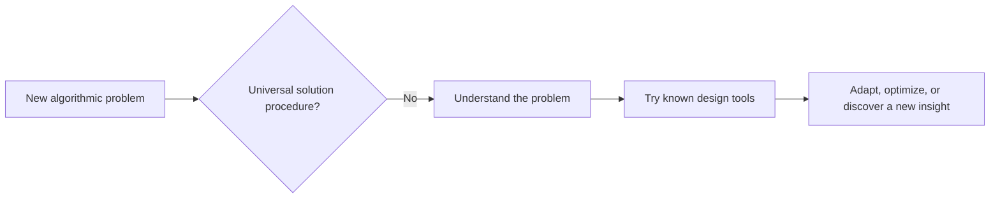
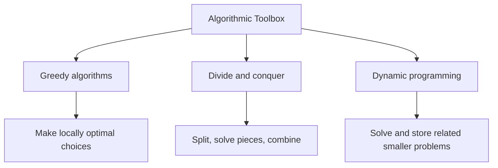
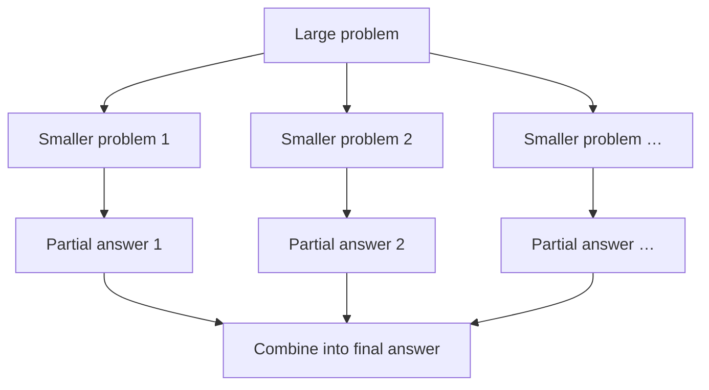
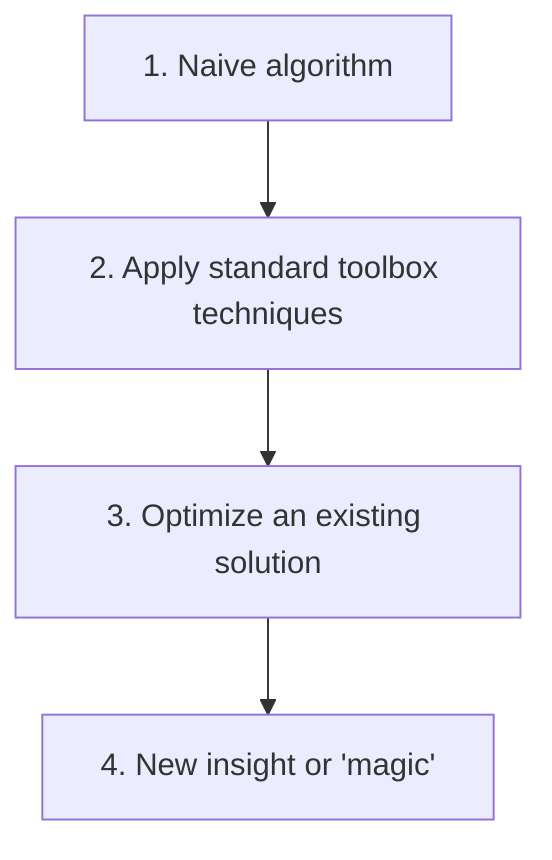

# Course Overview: Building an Algorithmic Toolbox

## Lecture purpose

This is the final lecture in the introductory unit of the **Algorithmic Toolbox** course within the Data Structures and Algorithms Specialization. It explains:

- why algorithm design is difficult to teach;
- what the course can realistically teach;
- the three major algorithm-design techniques covered next;
- the different levels of sophistication in algorithm design; and
- how the remaining course units are organized.

The course cannot provide a mechanical procedure that solves every possible algorithmic problem. Instead, it combines repeated practice with a toolbox of broadly useful design techniques.

## 1. Why algorithm design is difficult

Algorithms solve an enormous variety of problems, including:

- finding paths between locations on a map;
- finding matchings that satisfy or optimize some property; and
- identifying objects in a photograph.

These tasks sound unrelated because algorithmic problems can ask for many fundamentally different things. Consequently, there is no single unified technique that solves all of them.

### Contrast with a mechanical mathematical technique

In linear algebra, students can learn a standard technique such as row reduction. Given a system of linear equations, they can repeatedly apply the procedure and obtain an answer. In that setting, one can metaphorically put the problem into a machine, turn a crank, and receive a solution.

Algorithm design has no comparable universal machine:

There is no general procedure into which any algorithmic problem can be inserted to automatically produce a good algorithm. If such a procedure existed, teaching algorithm design would be easy: students would only need to learn and practice that one procedure.

### Some problems require a genuinely new insight

For a problem nobody has studied before, finding a useful algorithm may require a clever idea that nobody has previously discovered. This is one reason algorithms remain an active field of research: many important ideas and techniques are still unknown.

The course cannot teach undiscovered ideas, nor can it provide techniques custom-made for every problem a student might encounter later as a programmer. It therefore cannot teach everything anyone could ever need to solve every algorithmic problem.

## 2. What the course can teach

Although the course cannot provide a universal solution procedure, it can develop two valuable capabilities.

### 2.1 Practice designing and implementing algorithms

The course includes many homework problems so students can practice the complete problem-solving process:

1. Receive a problem they have not seen before.
2. Develop a good algorithm for it.
3. Implement the algorithm correctly.
4. Verify that the implementation works.
5. Ensure that it runs reasonably efficiently.

For broad, open-ended skills such as algorithm design, practice is itself a major part of learning. Exposure to many problems develops judgment, pattern recognition, and implementation skill.

### 2.2 A collection of common design tools

Students will not simply be given difficult programming problems without guidance. Although no technique solves every problem, several methods apply broadly and repeatedly.

The purpose of this first course is to build an **algorithmic toolbox** centered on three common and generally applicable design techniques:

## 3. Greedy algorithms

A greedy algorithm constructs a larger solution through a sequence of decisions. At each stage, it makes the choice that appears best immediately—the **locally optimal** or most “greedy” choice.

The process is:

1. Make the locally optimal decision.
2. Move to the next decision.
3. Again choose the locally optimal option.
4. Continue until a complete answer has been constructed.

The surprising and useful outcome, when the method applies, is that a sequence of locally optimal decisions produces a **globally optimal** solution.

Greedy approaches can lead to especially clean algorithms. However, they do not work for every problem, so students must learn how to recognize situations in which greedy choices can be justified.

## 4. Divide and conquer

Divide and conquer solves a large problem by decomposing it into smaller pieces:

1. **Divide** the original problem into smaller subproblems.
2. **Conquer** the subproblems by solving each one.
3. **Combine** their answers to solve the original problem.

This technique is useful when the solution to a problem can be reconstructed efficiently from solutions to appropriately chosen smaller instances.

## 5. Dynamic programming

Dynamic programming is a subtler technique. It applies when a large problem belongs to a family of related problems whose solutions depend on one another in a useful way.

The method generally works from smaller problems upward:

1. Identify the relevant family of related problems.
2. Start with the smallest problems at the bottom.
3. Solve them and store their answers.
4. Use those saved answers to solve progressively larger problems.
5. Continue until the original large problem has been solved.

Dynamic programming avoids unnecessarily solving the same related problem repeatedly. Its central idea resembles the efficient Fibonacci method: preserve answers to smaller problems and reuse them when building larger answers.

## 6. What will be taught for each technique

For greedy algorithms, divide and conquer, and dynamic programming, the course will cover:

- how to recognize when the technique applies;
- how to analyze an algorithm built with it;
- how to implement it in practice; and
- how to use it effectively on concrete problems.

The techniques are not universal formulas. They are reusable patterns that improve the chance of recognizing a productive approach to a new problem.

## 7. Levels of algorithm design

The lecture describes several levels of sophistication in developing an algorithm. They form a useful progression:

The first three levels are skills students should become comfortable applying during this course. The fourth may require originality beyond what any standard technique can guarantee.

### Level 1: Develop a naive algorithm

A naive algorithm often comes directly from the problem definition. This was seen with both Fibonacci numbers and greatest common divisors: the definition was interpreted as a procedure, immediately producing a correct algorithm.

A common naive strategy for optimization problems is:

1. enumerate every possible way of solving the problem;
2. evaluate each possibility; and
3. return the best one.

Such algorithms are often very slow. Nevertheless, beginning with a naive solution is frequently worthwhile because it:

- confirms that at least one correct algorithm exists;
- tests whether the problem has been understood correctly;
- provides a working reference implementation;
- may be sufficient when inputs are small; and
- creates a starting point for later improvement.

Sometimes the naive solution performs well enough, and no further work is necessary. When it is too slow, move to the next level.

### Level 2: Look in the algorithmic toolbox

Ask whether a standard design technique applies:

- Can greedy choices solve the problem?
- Can the problem be divided into smaller independent pieces?
- Can dynamic programming exploit related or overlapping problems?

Recognizing an applicable standard technique may require relatively little new invention while producing an algorithm that works well.

### Level 3: Optimize the working algorithm

Once a correct algorithm exists, it can often be improved. Important asymptotic improvements might reduce runtime:

- from $O(n^3)$ to $O(n^2)$; or
- from $O(n^2)$ to $O(n)$.

Possible optimization strategies include:

- rearranging the order of operations to eliminate unnecessary work;
- avoiding repeated calculations;
- introducing an appropriate data structure; and
- otherwise reorganizing the computation.

The course discusses some of these improvement methods. By the end, students should be comfortable producing naive solutions, applying standard design techniques, and optimizing existing algorithms.

### Level 4: Find a unique insight—the “magic” level

Sometimes the first three levels are not enough:

- the naive algorithm is unacceptably slow;
- none of the standard tools applies directly; and
- ordinary optimization cannot produce the required improvement.

In such cases, a workable algorithm may require a unique, clever idea—what the lecturer informally calls **magic**. This could be an insight nobody has previously had for that problem.

There is only so much a course can do to teach the production of such insights. It can present algorithms based on clever ideas and help students appreciate the thought involved, even when the original discovery process cannot be reproduced as a standard recipe.

This distinction is useful when judging what a problem expects: some exercises test known techniques, while genuinely new research problems may demand original insights.

## 8. A practical workflow for new problems

The lecture's ideas can be turned into a working process:

1. **Understand the problem precisely.** Identify the input, output, constraints, and correctness requirement.
2. **Create a naive solution.** Establish correctness and confirm understanding.
3. **Analyze its runtime.** Decide whether it is adequate for the expected inputs.
4. **Consult the toolbox.** Look for greedy, divide-and-conquer, dynamic-programming, or other known patterns.
5. **Implement and verify.** Ensure the algorithm works in practice.
6. **Optimize if needed.** Remove repeated work, reorganize operations, or use better data structures.
7. **Seek a deeper structural insight** if standard techniques still do not meet the requirements.

| Stage | Main question |
|---|---|
| Naive solution | Do I understand the problem, and can I solve it at all? |
| Standard technique | Does a known design pattern fit the problem's structure? |
| Optimization | Can I reduce unnecessary work or improve the runtime class? |
| New insight | Is there a previously unnoticed property that changes the problem? |

## 9. How this overview connects to the introductory unit

The introduction established the foundation for the rest of the course:

- **Why algorithms matter:** choosing the right method can separate an impossible computation from an immediate one.
- **Fibonacci numbers:** direct recursion was correct but exponentially slow; storing and reusing earlier answers made computation efficient.
- **Greatest common divisors:** the Euclidean algorithm used a structural lemma to replace a large problem with a smaller equivalent one.
- **Asymptotic notation:** Big-O provides a clean way to describe how running time scales while ignoring machine-dependent constant factors.

The course now moves from motivation and runtime analysis to the major ways algorithms are designed.

## 10. Organization of the remaining course

Each upcoming unit focuses on one major technique and explains where it applies, how to analyze it, and how to implement it:

| Unit | Instructor | Main topic |
|---|---|---|
| Next unit | Michael | Greedy algorithms |
| Following unit | Neil | Divide and conquer |
| Final technique unit mentioned | Pavel | Dynamic programming |

Daniel concludes the introductory segment and hands the course to Michael, who begins the study of greedy algorithms in the next lecture.

## Central takeaway

Algorithm design has no universal recipe. The course therefore develops algorithmic skill through two complementary methods:

1. repeated practice on unfamiliar problems; and
2. mastery of a toolbox containing broadly useful design techniques.

Students should learn to start with a correct naive solution, recognize when a standard technique applies, analyze and optimize the result, and appreciate that some difficult problems ultimately require a new structural insight.
