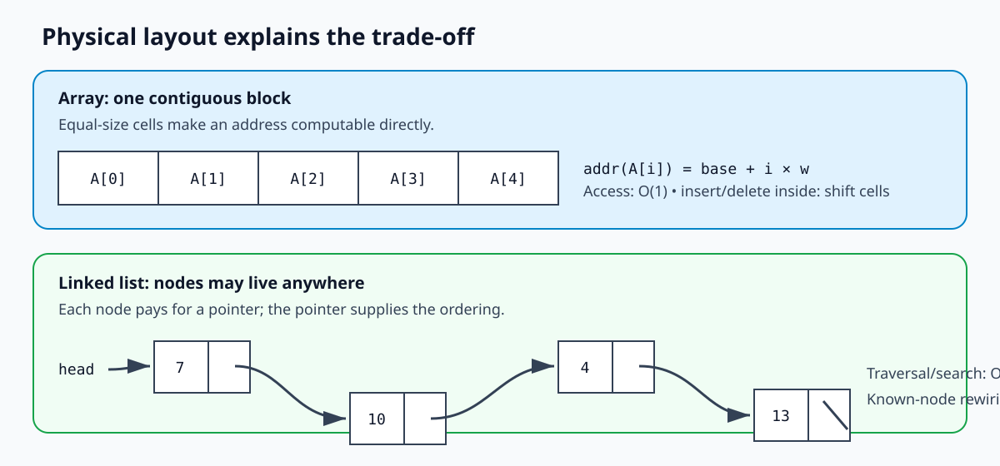
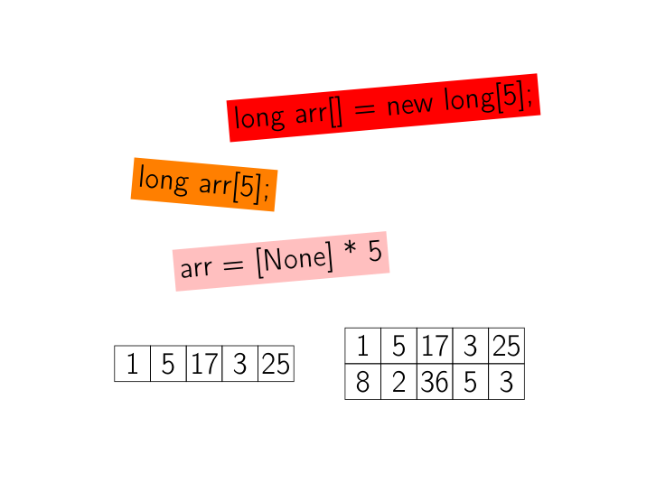
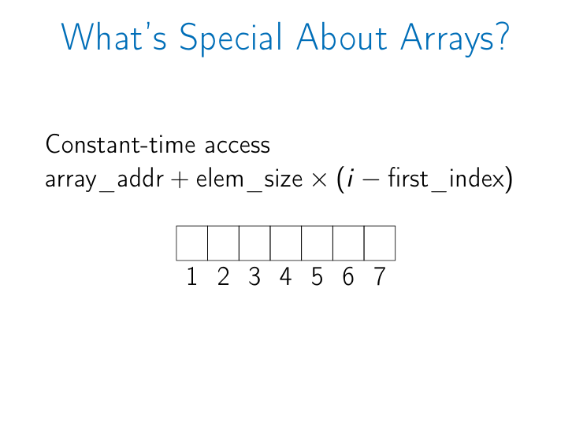
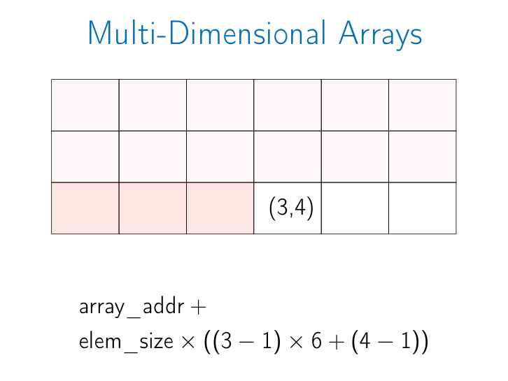
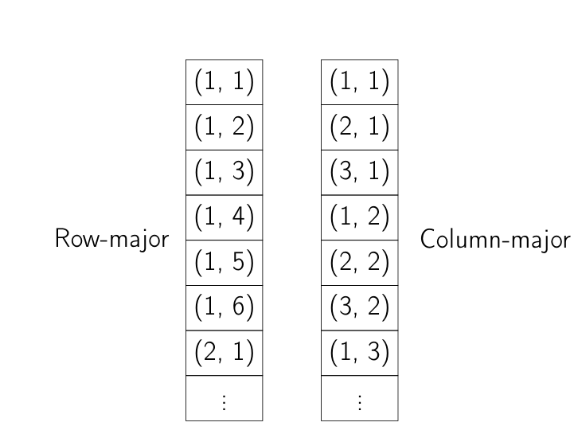
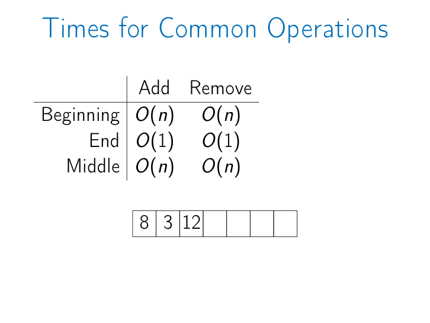
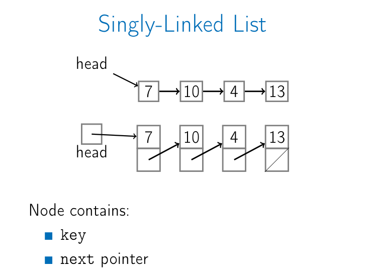
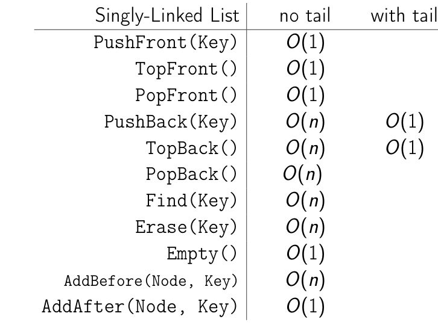
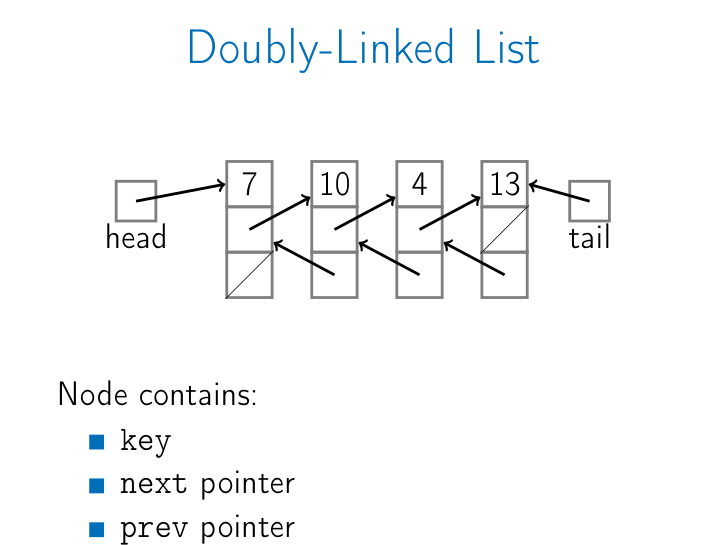
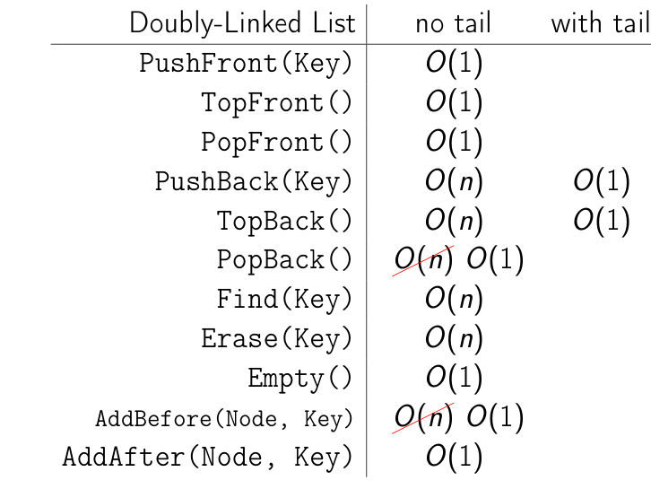

# Lecture 05.1 - Arrays and Linked Lists

Source: [05_1_arrays_and_lists.pdf](05_1_arrays_and_lists.pdf) (118 slides)

This guide turns the incremental slide animations into one continuous explanation. By the end, you should be able to explain how arrays and linked lists are stored, derive their operation costs, and implement the linked-list operations shown in the lecture.

## 1. The central trade-off

An array stores elements next to one another. That layout makes the address of any indexed element directly computable, so random access is fast. A linked list stores each element inside a node that points to another node. Nodes do not need to be adjacent, which makes local insertion and removal easy, but reaching an arbitrary element requires following pointers.



Keep this rule in mind:

- Arrays make positions cheap to reach but expensive to move around.
- Linked lists make known nodes cheap to reconnect but expensive to find.

## 2. Arrays

### 2.1 What an array is

An array is a contiguous area of memory containing equal-size elements indexed by contiguous integers. All three parts matter:

1. **Contiguous memory**: the cells are adjacent.
2. **Equal-size elements**: every step between cells is the same number of bytes.
3. **Contiguous indices**: the legal indices form an unbroken range, such as `0..n-1` or `1..n`.

The lecture shows familiar creation syntax:

```text
C/C++:  long arr[5];
Java:   long[] arr = new long[5];
Python: arr = [None] * 5
```

It also contrasts a one-dimensional row such as `[1, 5, 17, 3, 25]` with a two-dimensional arrangement.



### 2.2 Why indexed access is O(1)

Suppose:

- `base` is the address of the first array element,
- `w` is the size of one element in bytes,
- `L` is the first legal index,
- `i` is the requested index.

Then:

```text
address(A[i]) = base + w * (i - L)
```

The machine performs a fixed number of arithmetic operations regardless of the array length, so access is `O(1)`.



This does **not** mean searching an unsorted array is `O(1)`. If the index is already known, access is `O(1)`; if only a key is known, finding its index may still require `O(n)` comparisons.

### 2.3 Multi-dimensional arrays are linear memory

A rectangular matrix is still stored in a one-dimensional memory block. The language must map a coordinate such as `(row, column)` to a linear offset.

For a matrix with `C` columns, 1-based indices, and row-major storage:

```text
offset(row, column) = (row - 1) * C + (column - 1)
address              = base + w * offset
```

For the lecture's coordinate `(3, 4)` in a matrix with six columns:

```text
offset = (3 - 1) * 6 + (4 - 1)
       = 12 + 3
       = 15

address = base + 15 * w
```



Two common layouts are:

- **Row-major**: `(1,1), (1,2), ..., (1,6), (2,1), ...`; a complete row is stored before the next row.
- **Column-major**: `(1,1), (2,1), (3,1), (1,2), ...`; a complete column is stored before the next column.



The difference affects the address formula and cache behavior, but not the fact that any coordinate can be translated to an address in `O(1)`.

### 2.4 Inserting and removing in an array

The lecture assumes an array with available capacity; resizing a full dynamic array is outside this deck.

| Location | Add | Remove | Reason |
|---|---:|---:|---|
| End | `O(1)` | `O(1)` | Write or clear the next occupied cell; no other element moves. |
| Beginning | `O(n)` | `O(n)` | Shift all existing elements right or left. |
| Middle | `O(n)` | `O(n)` | Shift the suffix after the insertion/removal position. |

The animation begins with `[5, 8, 3, 12]`. Appending `4` touches only the next free cell. Removing it also touches only that cell. Removing `5` from the beginning shifts `8, 3, 12` left. Removing a middle item similarly closes the gap by shifting later elements.



The array section therefore concludes:

- contiguous, equal-size, integer-indexed elements;
- `O(1)` access to any known index;
- `O(1)` add/remove at the end when capacity exists;
- `O(n)` add/remove at an arbitrary location.

## 3. Singly linked lists

### 3.1 Structure

A singly linked list has a `head` pointer. Each node contains:

- `key`: the stored value;
- `next`: a pointer to the following node.

The last node has `next = nil`. The nodes can occupy unrelated memory addresses; their pointers, not physical adjacency, establish the order.



An optional `tail` pointer remembers the last node. Useful invariants are:

```text
empty list:     head = nil and tail = nil
one-node list:  head = tail
nonempty list:  tail.next = nil
```

### 3.2 The list API from the lecture

| Operation | Meaning |
|---|---|
| `PushFront(key)` | Add `key` at the front. |
| `TopFront()` | Return the front key without removing it. |
| `PopFront()` | Remove the front item. |
| `PushBack(key)` | Add at the back; also called `Append`. |
| `TopBack()` | Return the back key without removing it. |
| `PopBack()` | Remove the back item. |
| `Find(key)` | Report whether the key occurs. |
| `Erase(key)` | Remove the key from the list. |
| `Empty()` | Report whether the list is empty. |
| `AddBefore(node, key)` | Insert a new key immediately before a known node. |
| `AddAfter(node, key)` | Insert a new key immediately after a known node. |

### 3.3 Why the front is cheap

To push `26` in front of `7 -> 10 -> 4 -> 13`, create one node, point it to the old head, and move `head` to it. The list length is irrelevant, so `PushFront` is `O(1)`.

To pop the front, move `head` to `head.next`. Again, no traversal is needed, so `PopFront` is `O(1)`.

### 3.4 Why a tail helps only some operations

Without `tail`, `PushBack` and `TopBack` must follow `next` pointers from `head` to the last node, so they are `O(n)`. With `tail`, the last node is directly available:

- `PushBack` becomes `O(1)` because `tail.next` and `tail` can be updated directly.
- `TopBack` becomes `O(1)` because `tail.key` is directly available.
- `PopBack` remains `O(n)` in a singly linked list. The tail node does not know its predecessor, so the algorithm must scan from `head` to find the second-last node.

### 3.5 Singly linked-list pseudocode

The following is the lecture algorithm, with assignment written as `<-`.

```text
PushFront(key):
    node <- new Node
    node.key <- key
    node.next <- head
    head <- node
    if tail = nil:
        tail <- head
```

The final condition handles insertion into an empty list.

```text
PopFront():
    if head = nil:
        error "empty list"
    head <- head.next
    if head = nil:
        tail <- nil
```

The second condition handles removal of the only node.

```text
PushBack(key):
    node <- new Node
    node.key <- key
    node.next <- nil
    if tail = nil:
        head <- node
        tail <- node
    else:
        tail.next <- node
        tail <- node
```

```text
PopBack():
    if head = nil:
        error "empty list"
    if head = tail:
        head <- nil
        tail <- nil
    else:
        p <- head
        while p.next.next != nil:
            p <- p.next
        p.next <- nil
        tail <- p
```

The loop stops at the predecessor of the old tail, which is why `PopBack` is `O(n)`.

```text
AddAfter(node, key):
    node2 <- new Node
    node2.key <- key
    node2.next <- node.next
    node.next <- node2
    if tail = node:
        tail <- node2
```

`AddAfter` is `O(1)` because the target node already provides the pointer that must be replaced. By contrast, `AddBefore(node, key)` is `O(n)` in a singly linked list because the predecessor of `node` must first be found.

### 3.6 Singly linked-list costs

| Operation | Without tail | With tail |
|---|---:|---:|
| `PushFront` | `O(1)` | `O(1)` |
| `TopFront` | `O(1)` | `O(1)` |
| `PopFront` | `O(1)` | `O(1)` |
| `PushBack` | `O(n)` | `O(1)` |
| `TopBack` | `O(n)` | `O(1)` |
| `PopBack` | `O(n)` | `O(n)` |
| `Find` | `O(n)` | `O(n)` |
| `Erase(key)` | `O(n)` | `O(n)` |
| `Empty` | `O(1)` | `O(1)` |
| `AddBefore(known node)` | `O(n)` | `O(n)` |
| `AddAfter(known node)` | `O(1)` | `O(1)` |



## 4. Doubly linked lists

### 4.1 Structure and benefit

A doubly linked node contains `key`, `next`, and `prev`. A `tail` pointer can now move backward through `tail.prev`, so removing the last node no longer requires a scan.



The extra `prev` pointer costs additional memory and requires more careful updates, but it enables:

- `PopBack` in `O(1)` when a tail is stored;
- `AddBefore(known node)` in `O(1)`;
- removal of a known node in `O(1)` by reconnecting its two neighbors.

Searching for a key is still `O(n)`. The pointers improve local rewiring, not key lookup.

### 4.2 Doubly linked-list pseudocode

```text
PushBack(key):
    node <- new Node
    node.key <- key
    node.next <- nil
    if tail = nil:
        head <- node
        tail <- node
        node.prev <- nil
    else:
        tail.next <- node
        node.prev <- tail
        tail <- node
```

```text
PopBack():
    if head = nil:
        error "empty list"
    if head = tail:
        head <- nil
        tail <- nil
    else:
        tail <- tail.prev
        tail.next <- nil
```

```text
AddAfter(node, key):
    node2 <- new Node
    node2.key <- key
    node2.next <- node.next
    node2.prev <- node
    node.next <- node2
    if node2.next != nil:
        node2.next.prev <- node2
    if tail = node:
        tail <- node2
```

The order matters: `node2` first remembers the old successor, then both directions are repaired.

```text
AddBefore(node, key):
    node2 <- new Node
    node2.key <- key
    node2.next <- node
    node2.prev <- node.prev
    node.prev <- node2
    if node2.prev != nil:
        node2.prev.next <- node2
    if head = node:
        head <- node2
```

The last condition handles insertion before the old head.

### 4.3 Doubly linked-list costs

| Operation | Without tail | With tail |
|---|---:|---:|
| `PushFront`, `TopFront`, `PopFront` | `O(1)` | `O(1)` |
| `PushBack`, `TopBack` | `O(n)` | `O(1)` |
| `PopBack` | `O(n)` | `O(1)` |
| `Find`, `Erase(key)` | `O(n)` | `O(n)` |
| `Empty` | `O(1)` | `O(1)` |
| `AddBefore(known node)` | `O(1)` | `O(1)` |
| `AddAfter(known node)` | `O(1)` | `O(1)` |



`Erase(key)` is shown as `O(n)` because the key must be found first. If the caller already has the node reference, deleting that known node is `O(1)` in a doubly linked list.

## 5. Choosing between the structures

| Need | Array | Singly linked list | Doubly linked list |
|---|---|---|---|
| Direct access by index | Excellent: `O(1)` | Poor: `O(n)` | Poor: `O(n)` |
| Compact storage and cache locality | Excellent | Weaker | Weakest of the three |
| Insert/remove at front | `O(n)` | `O(1)` | `O(1)` |
| Append | `O(1)` with available capacity | `O(1)` with tail | `O(1)` with tail |
| Remove at back | `O(1)` | `O(n)` | `O(1)` with tail |
| Insert around a known node | Requires shifts | After: `O(1)`; before: `O(n)` | Before/after: `O(1)` |
| Contiguous memory required | Yes | No | No |
| Per-element pointer overhead | None | One pointer | Two pointers |

## 6. Common mistakes

- Calling array lookup `O(1)` when the index is not known. Searching by value is a different operation.
- Saying all array appends are always `O(1)`. The lecture assumes free capacity; resizing a dynamic array can take `O(n)`.
- Believing a tail pointer makes singly linked `PopBack` constant time. It does not provide the predecessor.
- Forgetting to update `tail` when the last node is removed or when insertion occurs after the old tail.
- Updating only one direction in a doubly linked list. Both `next` and `prev` invariants must remain consistent.
- Quoting `O(1)` insertion without stating that the target node is already known. Finding the target may cost `O(n)`.

## 7. Quick self-check

1. In a 1-based row-major matrix with 8 columns, what is the linear offset of `(4, 3)`?  
   **Answer:** `(4 - 1) * 8 + (3 - 1) = 26`.

2. Why is removing the first array element `O(n)`?  
   **Answer:** Every later element must shift one cell left to preserve contiguous indexing.

3. With only `head` and `tail`, why is singly linked `PopBack` still `O(n)`?  
   **Answer:** The list must find the node whose `next` points to the tail.

4. When is doubly linked deletion `O(1)`?  
   **Answer:** When the node to delete is already known; locating it by key is still `O(n)`.

## 8. Slide coverage map

This table makes the consolidation auditable. Incremental animation frames are represented by their completed explanation above.

| Slides | Covered content |
|---|---|
| 1-3 | Lecture title, outline, language syntax, 1D and 2D examples. |
| 4-11 | Array definition and constant-time address computation. |
| 12-22 | Multi-dimensional arrays, `(3,4)` address example, row-major and column-major layouts. |
| 23-33 | Add/remove animations at end, beginning, and middle; final complexity table. |
| 34-38 | Array summary. |
| 39-40 | Linked-list section transition and singly linked node anatomy. |
| 41-51 | Complete list API. |
| 52-72 | `PushFront`, `PopFront`, `PushBack`, and `PopBack` animations, with and without tail. |
| 73-83 | Singly linked pseudocode for `PushFront`, `PopFront`, `PushBack`, `PopBack`, and `AddAfter`. |
| 84-94 | Incrementally built singly linked complexity table. |
| 95-102 | Doubly linked anatomy and `PopBack` pointer animation. |
| 103-111 | Doubly linked pseudocode for `PushBack`, `PopBack`, `AddAfter`, and `AddBefore`. |
| 112-113 | Final singly and doubly linked complexity tables. |
| 114-118 | Linked-list summary: front/back costs, search, non-contiguous storage, and known-node updates. |

