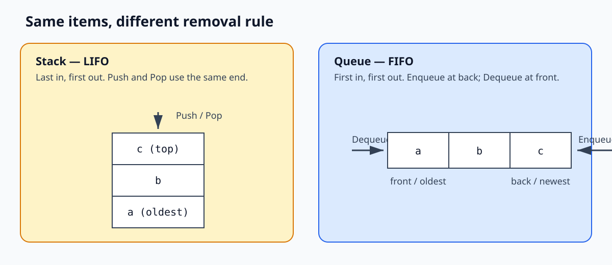
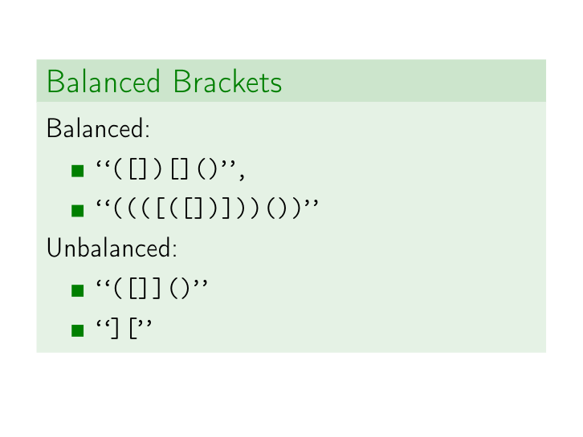
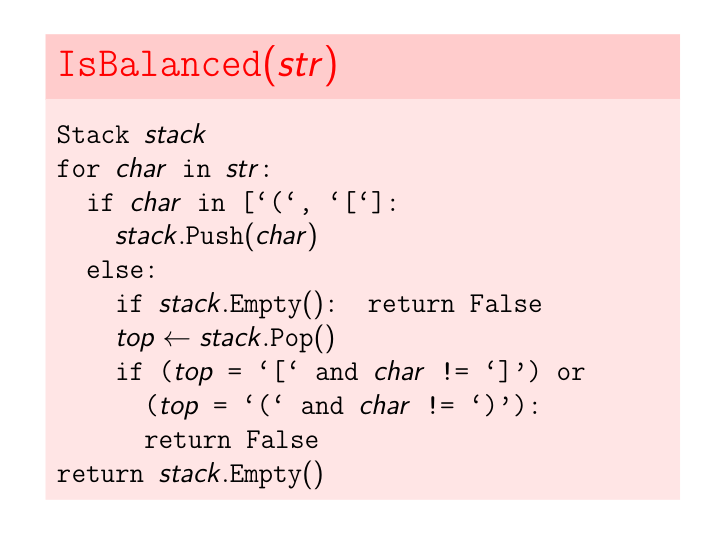
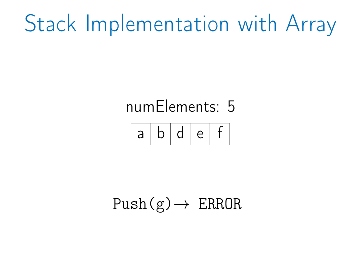
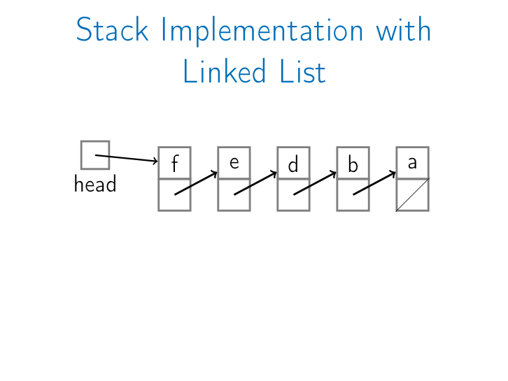
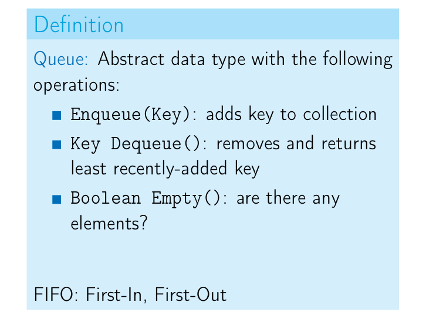
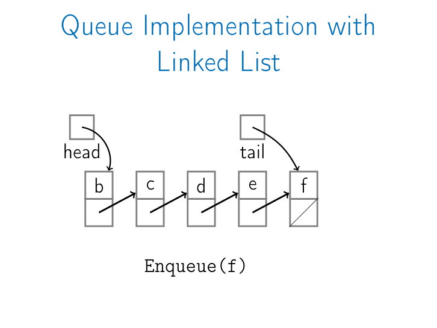
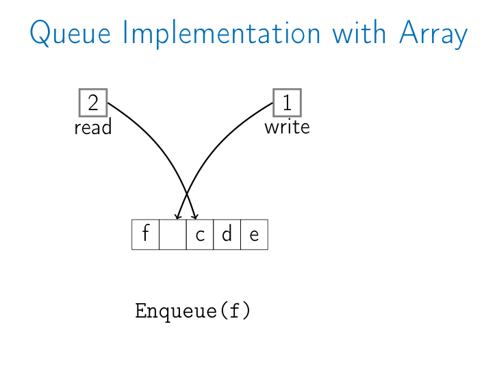
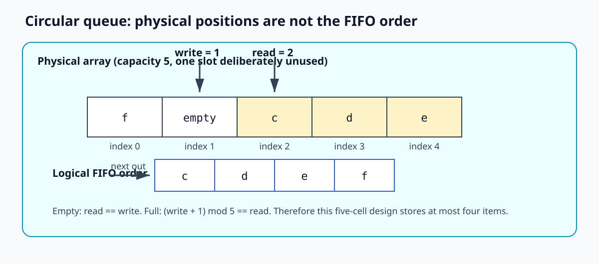
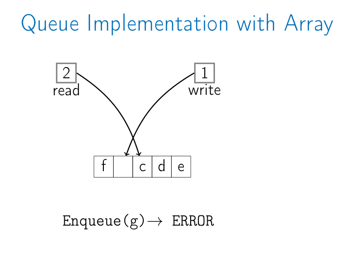

# Lecture 05.2 - Stacks and Queues

Source: [05_2_stacks_and_queues.pdf](05_2_stacks_and_queues.pdf) (211 slides)

This guide combines the deck's long operation animations into state traces. It explains the abstract data types first, then shows how arrays and linked lists implement the same behavior.

## 1. Abstract behavior versus implementation

A **stack** and a **queue** are abstract data types (ADTs). An ADT defines which operations are available and what those operations mean. It does not require one particular memory representation.

- A stack can be implemented with an array or a linked list.
- A queue can be implemented with a circular array or a linked list with a tail pointer.



The implementation may change, but clients must observe the same ordering rule.

## 2. Stacks

### 2.1 Definition: last in, first out

A stack provides:

| Operation | Contract |
|---|---|
| `Push(key)` | Add `key` to the collection. |
| `Top()` | Return the most recently added key without removing it. |
| `Pop()` | Remove and return the most recently added key. |
| `Empty()` | Report whether there are any elements. |

Because `Pop` removes the newest item, a stack is **LIFO**: last in, first out. Stacks are therefore sometimes called LIFO queues.

If the operations are:

```text
Push(a), Push(b), Push(c), Pop(), Pop()
```

the returned values are `c`, then `b`.

### 2.2 Application: balanced brackets

The lecture asks whether a string containing `(`, `)`, `[`, and `]` is balanced.

Balanced examples:

```text
([])[]()
((([([])]))())
```

Unbalanced examples:

```text
([]]()
][
```



The key observation is that a closing bracket must match the **most recently opened bracket that has not yet been closed**. That is exactly LIFO behavior.

```text
IsBalanced(str):
    stack <- empty Stack

    for char in str:
        if char is '(' or '[':
            stack.Push(char)
        else:
            if stack.Empty():
                return False

            top <- stack.Pop()
            if (top = '[' and char != ']') or
               (top = '(' and char != ')'):
                return False

    return stack.Empty()
```



There are three different failure modes:

1. A closer appears while the stack is empty, as in `][`.
2. A closer has the wrong type for the top opener, such as `(]`.
3. The scan ends with unclosed openers still in the stack, such as `((`.

For a string of length `n`, the algorithm uses `O(n)` time. Its stack uses at most `O(n)` extra space in the worst case.

## 3. Stack implementation with a fixed-size array

### 3.1 Representation

Store stack items in `data[0..capacity-1]` and maintain `numElements`:

```text
bottom = data[0]
top    = data[numElements - 1]     when nonempty
next free cell = data[numElements]
```

The operations are:

```text
Push(key):
    if numElements = capacity:
        error "full stack"
    data[numElements] <- key
    numElements <- numElements + 1

Top():
    if numElements = 0:
        error "empty stack"
    return data[numElements - 1]

Pop():
    if numElements = 0:
        error "empty stack"
    numElements <- numElements - 1
    return data[numElements]

Empty():
    return numElements = 0
```

Each operation reads or writes a fixed number of cells, so each is `O(1)`.

### 3.2 The complete array animation as one trace

The deck uses an array of capacity five:

| Operation | Array contents, bottom to top | Result |
|---|---|---|
| start | `[]` | `numElements = 0` |
| `Push(a)` | `[a]` |  |
| `Push(b)` | `[a, b]` |  |
| `Top()` | `[a, b]` | returns `b`; no removal |
| `Push(c)` | `[a, b, c]` |  |
| `Pop()` | `[a, b]` | returns `c` |
| `Push(d)` | `[a, b, d]` |  |
| `Push(e)` | `[a, b, d, e]` |  |
| `Push(f)` | `[a, b, d, e, f]` | array is full |
| `Push(g)` | unchanged | error |
| `Empty()` | unchanged | `False` |
| five `Pop()` calls | `[a,b,d,e]`, `[a,b,d]`, `[a,b]`, `[a]`, `[]` | return `f,e,d,b,a` |
| `Empty()` | `[]` | `True` |



This lecture uses fixed capacity. A dynamic array could allocate a larger block and copy elements when full, but that resizing policy is not part of the animation.

## 4. Stack implementation with a linked list

Use the front of a singly linked list as the top of the stack:

| Stack operation | List operation |
|---|---|
| `Push(key)` | `PushFront(key)` |
| `Top()` | `TopFront()` |
| `Pop()` | `TopFront()` followed by `PopFront()` |
| `Empty()` | `Empty()` |

All are `O(1)` because no traversal occurs. The `head` always points to the newest item.

The linked-list animation performs the same logical sequence as the array animation. The stack grows as `a`, then `b -> a`, then `c -> b -> a`; after `Pop`, `b` is again the head. It later grows to `f -> e -> d -> b -> a`, then pops `f, e, d, b, a` in that order.



Unlike the fixed array, the linked list has no predetermined cell limit. It can keep growing until memory allocation fails, but each node needs a pointer in addition to its key.

### 4.1 Array stack versus linked-list stack

| Property | Array | Linked list |
|---|---|---|
| `Push`, `Pop`, `Top`, `Empty` | `O(1)` | `O(1)` |
| Capacity | Fixed in the deck | Grows node by node |
| Memory locality | Strong | Weaker |
| Per-item pointer overhead | None | One `next` pointer |
| Full condition | `numElements = capacity` | Normally only allocation failure |

The stack section's conclusion is that both representations implement every stack operation in `O(1)`.

## 5. Queues

### 5.1 Definition: first in, first out

A queue provides:

| Operation | Contract |
|---|---|
| `Enqueue(key)` | Add `key` to the collection. |
| `Dequeue()` | Remove and return the least recently added key. |
| `Empty()` | Report whether there are any elements. |

This is **FIFO**: first in, first out.



If the operations are:

```text
Enqueue(a), Enqueue(b), Enqueue(c), Dequeue(), Dequeue()
```

the returned values are `a`, then `b`.

## 6. Queue implementation with a linked list

Maintain both `head` and `tail`:

- `head` points to the front/oldest item;
- `tail` points to the back/newest item.

Map the queue API to the list API:

| Queue operation | List operation | Cost |
|---|---|---:|
| `Enqueue(key)` | `PushBack(key)` | `O(1)` with tail |
| `Dequeue()` | `TopFront()` then `PopFront()` | `O(1)` |
| `Empty()` | `Empty()` | `O(1)` |

The head and tail must both become `nil` when the last item is dequeued.

### 6.1 The linked-list queue trace

The animation can be compressed to this sequence:

| Step | Logical queue, front to back | Return value |
|---|---|---|
| start | `[]` |  |
| enqueue `a`, `b`, `c` | `[a, b, c]` |  |
| dequeue | `[b, c]` | `a` |
| enqueue `d`, `e`, `f` | `[b, c, d, e, f]` |  |
| dequeue repeatedly | `[c,d,e,f]`, `[d,e,f]`, `[e,f]`, `[f]`, `[]` | `b,c,d,e,f` |
| `Empty()` | `[]` | `True` |



The list never shifts existing nodes. Enqueue changes the old tail and the `tail` pointer; dequeue changes `head`.

## 7. Queue implementation with a circular array

### 7.1 Why an ordinary linear interpretation wastes space

If dequeuing merely increments a front index, empty cells accumulate at the left. Shifting every remaining element after each dequeue would restore those cells, but shifting costs `O(n)`.

A circular queue treats the array's end as connected to its beginning. Indices advance with modulo arithmetic:

```text
next(i) = (i + 1) mod capacity
```

Maintain:

- `read`: index of the next item to dequeue;
- `write`: index of the next free cell for enqueue.

### 7.2 Empty and full states in the lecture's design

The deck uses a five-cell array and deliberately leaves one cell unused:

```text
empty: read = write
full:  next(write) = read
```

Leaving one slot unused removes the ambiguity that would otherwise occur because `read = write` could mean either empty or completely full. Consequently, a five-cell array stores at most four queue elements in this implementation.

```text
Enqueue(key):
    if next(write) = read:
        error "full queue"
    data[write] <- key
    write <- next(write)

Dequeue():
    if read = write:
        error "empty queue"
    key <- data[read]
    read <- next(read)
    return key

Empty():
    return read = write
```

Every operation is `O(1)`.

### 7.3 The complete circular-array trace

The physical array has indices `0..4`:

| Operation | `read` | `write` | Physical occupied cells | Logical FIFO order |
|---|---:|---:|---|---|
| start | 0 | 0 | none | `[]` |
| enqueue `a` | 0 | 1 | `0:a` | `[a]` |
| enqueue `b` | 0 | 2 | `0:a, 1:b` | `[a,b]` |
| enqueue `c` | 0 | 3 | `0:a, 1:b, 2:c` | `[a,b,c]` |
| dequeue -> `a` | 1 | 3 | `1:b, 2:c` | `[b,c]` |
| dequeue -> `b` | 2 | 3 | `2:c` | `[c]` |
| enqueue `d` | 2 | 4 | `2:c, 3:d` | `[c,d]` |
| enqueue `e` | 2 | 0 | `2:c, 3:d, 4:e` | `[c,d,e]` |
| enqueue `f` | 2 | 1 | `0:f, 2:c, 3:d, 4:e` | `[c,d,e,f]` |
| enqueue `g` | 2 | 1 | unchanged | error: full |
| dequeue -> `c` | 3 | 1 | `0:f, 3:d, 4:e` | `[d,e,f]` |
| dequeue -> `d` | 4 | 1 | `0:f, 4:e` | `[e,f]` |
| dequeue -> `e` | 0 | 1 | `0:f` | `[f]` |
| dequeue -> `f` | 1 | 1 | none | `[]` |
| `Empty()` | 1 | 1 | none | `True` |

The visually confusing wrapped state has `f` physically before `c`, but `read = 2`, so `c` is still the next item out.





When the queue contains `[c,d,e,f]`, `next(write) = next(1) = 2 = read`; therefore enqueueing `g` must fail.



## 8. Complexity summary

| ADT | Operation | Array implementation | Linked-list implementation |
|---|---|---:|---:|
| Stack | `Push` | `O(1)` in fixed-capacity deck | `O(1)` |
| Stack | `Top` | `O(1)` | `O(1)` |
| Stack | `Pop` | `O(1)` | `O(1)` |
| Stack | `Empty` | `O(1)` | `O(1)` |
| Queue | `Enqueue` | `O(1)` circular array | `O(1)` with tail |
| Queue | `Dequeue` | `O(1)` circular array | `O(1)` from head |
| Queue | `Empty` | `O(1)` | `O(1)` |

The data structure determines how these costs are achieved:

- Stack array: operate at `numElements - 1`.
- Stack list: operate at `head`.
- Queue circular array: operate at `read` and `write`, wrapping modulo capacity.
- Queue list: remove at `head`, insert at `tail`.

## 9. Common mistakes

- Using a queue for balanced brackets. The newest opener must be matched first, so the algorithm needs a stack.
- Making `Top()` remove the element. `Top()` observes; `Pop()` removes and returns.
- Implementing a linked-list stack at the tail of a singly linked list. `PopBack` would be `O(n)`; using the head keeps all operations `O(1)`.
- Implementing queue enqueue at list head and dequeue at list tail. Dequeue would become `O(n)` in a singly linked list.
- Moving every circular-queue element after a dequeue. Only `read` needs to advance.
- Reading a circular array left-to-right as its logical order. Start at `read` and wrap.
- Forgetting the deck's unused-slot rule. Five physical cells provide four usable positions.
- Treating `read = write` as full in this design. Here it means empty; full is `next(write) = read`.

## 10. Interactive web visualizers

These external tools were checked on 2026-08-03. They require JavaScript and are best used in a desktop browser.

### 10.1 Compare LIFO and FIFO directly

[Open the Stack & Queue Visualizer](https://dsvisualizer.sudeepmishra.com.np/)

This tool has Stack, Queue, and Combined modes, plus speed, single-step, pseudocode, explanation, and operation-history controls.

Suggested experiment:

1. In Stack mode, push `a`, `b`, and `c`; use `Peek`, then `Pop` twice. Confirm that the results are `c`, then `b`.
2. Clear the structure and switch to Queue mode.
3. Enqueue `a`, `b`, and `c`; dequeue twice. Confirm that the results are `a`, then `b`.
4. Turn on the code and educational panels, then compare which end each operation changes.
5. Use Combined mode to keep the same input sequence visible in both structures.

### 10.2 Array versus linked implementations and circular wraparound

[Open DS Simulator](https://dssim.vercel.app/)

Use the Stack and Queue controls in the Linear Structures section. The simulator can switch representations and includes both linear and circular queues.

Suggested reconstruction of slides 164-208:

1. Select `Queue`, choose the array representation, and switch to `Circular Queue`.
2. Enqueue `a`, `b`, and `c`.
3. Dequeue twice so the front/read position advances.
4. Enqueue `d`, `e`, and `f`; watch the rear/write position wrap to the start of the array.
5. Compare the physical cells with the logical FIFO order beginning at the front/read pointer.
6. Continue until the full condition appears, then dequeue everything and confirm the empty condition.
7. Switch between array and linked-list representations to see that the public queue behavior stays the same even though the memory layout changes.

The simulator may use `front`/`rear` instead of the lecture's `read`/`write`; they represent the same roles.

## 11. Quick self-check

1. After `Push(1), Push(2), Push(3), Pop()`, what remains?  
   **Answer:** `[1,2]`, with `2` on top; `Pop()` returns `3`.

2. Why does `IsBalanced` return `stack.Empty()` at the end?  
   **Answer:** Correctly matched closers do not prove that every opener received a closer.

3. A circular queue has capacity 5, `read = 4`, and `write = 2`. Which indices are logically occupied?  
   **Answer:** Starting at `read` and stopping before `write`: indices `4, 0, 1`.

4. In the lecture design, when is that queue full?  
   **Answer:** When `(write + 1) mod 5 = read`.

## 12. Slide coverage map

| Slides | Covered content |
|---|---|
| 1-7 | Lecture outline and complete stack ADT definition. |
| 8-10 | Balanced-bracket problem, examples, and algorithm. |
| 11-59 | Fixed-array stack trace: pushes, `Top`, pops, full error, and `Empty`. |
| 60-108 | Linked-list stack trace with the same LIFO operations. |
| 109-111 | Stack summary: array/list implementations, `O(1)` operations, and LIFO terminology. |
| 112-117 | Queue section transition, API, and FIFO definition. |
| 118-160 | Linked-list queue animation: enqueue at tail, dequeue at head, and empty state. |
| 161-163 | Queue-to-list operation mapping. |
| 164-208 | Circular-array queue trace, wraparound, full error, repeated dequeue, and empty state. |
| 209-211 | Queue summary: linked list or array; every operation `O(1)`. |
