# Lecture 05.3 - Trees

Source: [05_3_trees.pdf](05_3_trees.pdf) (192 slides)

This guide consolidates the traversal animations into complete algorithms, output orders, and queue traces. It also makes the lecture's height convention explicit: an empty tree has height 0, so a leaf has height 1.

## 1. Why trees appear everywhere

A tree represents hierarchy: one item can contain, classify, or govern several smaller structures. The deck opens with six examples.

### 1.1 Sentence syntax

The sentence `I ate the cake` can be decomposed into a sentence (`S`), noun phrase (`NP`), and verb phrase (`VP`), then into parts such as verb (`V`), determiner (`Det`), and noun (`N`).

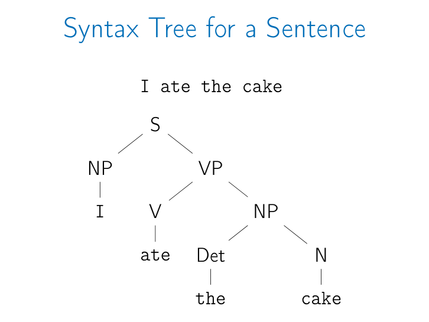

### 1.2 Mathematical expressions

The expression `2 sin(3z - 7)` has multiplication at the root. Its left operand is `2`; its right operand is `sin(...)`. Inside the sine, subtraction combines the product `3z` and `7`. The tree makes precedence unambiguous.

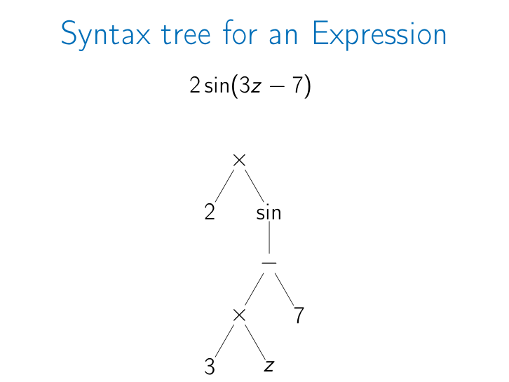

### 1.3 Geographic and taxonomic hierarchies

The geography example begins at `World`. The United Kingdom branch contains England, Northern Ireland, Scotland, Wales, and more. The United States branch includes Alabama, with cities such as Mobile and Montgomery, and Wyoming, with cities such as Cheyenne and Jackson. Ellipses show that the hierarchy continues beyond the displayed examples.

The partial animal hierarchy begins at `Animal` and includes:

- `Mammal`, with Marsupials, Primates, Carnivores, Rodents, and additional groups;
- `Fish`, `Bird`, `Amphibian`, and `Reptile`;
- `Invertebrate`, with `Insect` and `Arachnid`; the insect branch includes Beetles, Flies, Butterflies, and more.

These are not necessarily binary trees: a node may have any number of children.

### 1.4 Abstract syntax trees for code

For:

```text
while x < 0:
    x = x + 2
    foo(x)
```

the root is a `while` node. Its condition is a `<` comparison between variable `x` and constant `0`. Its body is a block containing an assignment and a procedure call. The assignment contains a `+` expression; the call contains the procedure `foo` and argument `x`.

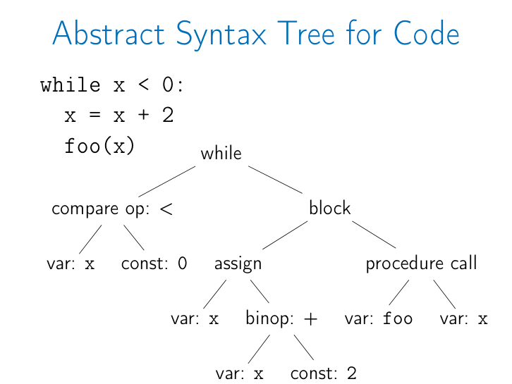

### 1.5 Binary search trees

The lecture's name tree has `Les` at the root. Smaller keys occur in left subtrees and larger keys in right subtrees. That ordering is the defining invariant of a binary search tree (BST).

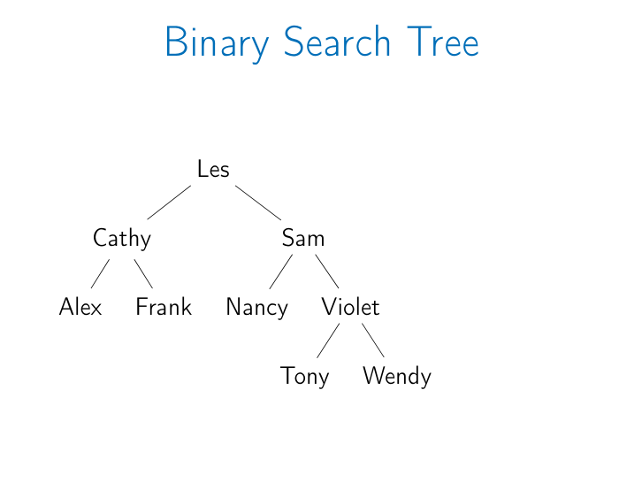

The examples show that a tree is a general structural pattern, not one single application.

## 2. Recursive definition

A tree is either:

1. empty, or
2. a node containing:
   - a key, and
   - a list of child trees.

This definition is recursive because every child is itself a tree. It naturally includes:

- an empty tree;
- a one-node tree such as `Fred`, whose child list is empty;
- a two-node tree such as root `Fred` with child `Sally`;
- arbitrarily large trees built by repeating the same rule.

## 3. Tree terminology

The terminology slides use this tree:

```text
             Fred
          /    |    \
       Kate  Sally  Jim
      /    \
    Sam    Hugh
```

### 3.1 Relationships

- **Root**: the top node. Here it is `Fred`.
- **Parent**: a node directly above another node. `Kate` is a parent of `Sam`.
- **Child**: a node directly below another node. `Sam` is a child of `Kate`.
- **Ancestor**: a parent, a parent's parent, and so on. The ancestors of `Sam` are `Kate` and `Fred`.
- **Descendant**: a child, a child's child, and so on. Fred's descendants are `Kate`, `Sally`, `Jim`, `Sam`, and `Hugh`.
- **Sibling**: nodes with the same parent. `Kate`, `Sally`, and `Jim` are siblings; `Sam` and `Hugh` are siblings.

An ancestor or descendant need not be adjacent. Parent/child means exactly one edge apart.

### 3.2 Node categories

- **Leaf**: a node with no children. `Sam`, `Hugh`, `Sally`, and `Jim` are leaves.
- **Interior node** or **non-leaf**: a node with at least one child. `Fred` and `Kate` are interior nodes.

### 3.3 Level

The lecture numbers levels from 1:

```text
level(node) = 1 + number of edges from the root to node
```

Therefore:

- `Fred` is at level 1;
- `Kate`, `Sally`, and `Jim` are at level 2;
- `Sam` and `Hugh` are at level 3.

Some books call the root's distance `depth 0`; that convention is compatible, because this lecture's `level = depth + 1`.

### 3.4 Height

The height of a node is the maximum number of nodes on a downward path from that node to a leaf. Equivalently under the lecture algorithm:

```text
height(empty) = 0
height(leaf)  = 1
```

In the terminology tree:

- each leaf has height 1;
- `Kate` has height 2;
- `Fred` and the whole tree have height 3.

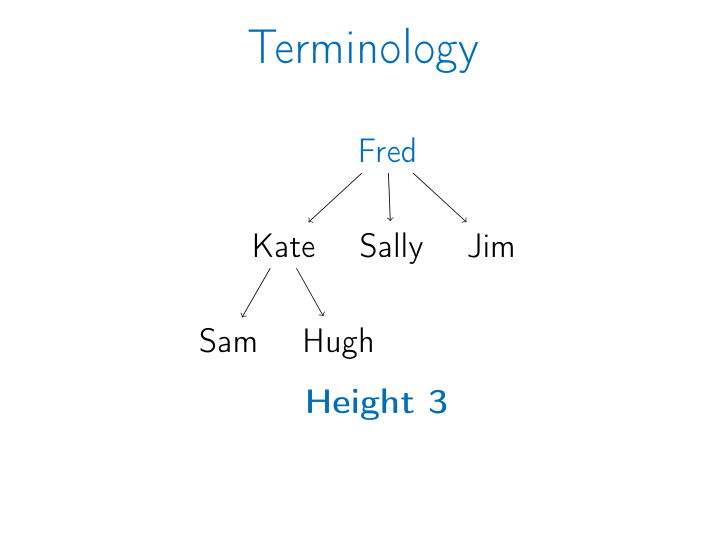

Other sources sometimes count edges and call a leaf's height 0. Always state the convention before comparing answers.

### 3.5 Forest

A **forest** is a collection of trees. Removing a tree's root leaves a forest containing the subtrees that were rooted at its children. The lecture illustrates separate trees rooted at `Kate` and `Sally`.

## 4. Representing tree nodes

A general tree node may contain:

```text
key
children: list of child nodes
parent: optional pointer to the parent
```

A binary tree has at most two children, so it commonly stores:

```text
key
left
right
parent: optional pointer to the parent
```

Missing children are represented by `nil`. A parent pointer is optional because downward traversals need only child pointers; it is useful when algorithms must move upward.

## 5. Recursive algorithms: height and size

Recursive algorithms fit trees because every left or right child is a smaller tree of the same kind.

### 5.1 Height

```text
Height(tree):
    if tree = nil:
        return 0
    return 1 + max(Height(tree.left),
                   Height(tree.right))
```

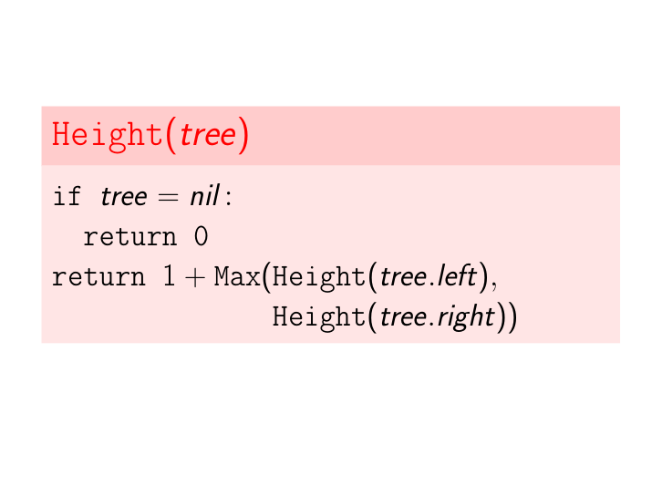

The base case assigns height 0 to an empty tree. A leaf has two empty children, so its result is `1 + max(0,0) = 1`. An interior node takes the larger child height because height follows the longest downward route.

### 5.2 Size

```text
Size(tree):
    if tree = nil:
        return 0
    return 1 + Size(tree.left) + Size(tree.right)
```

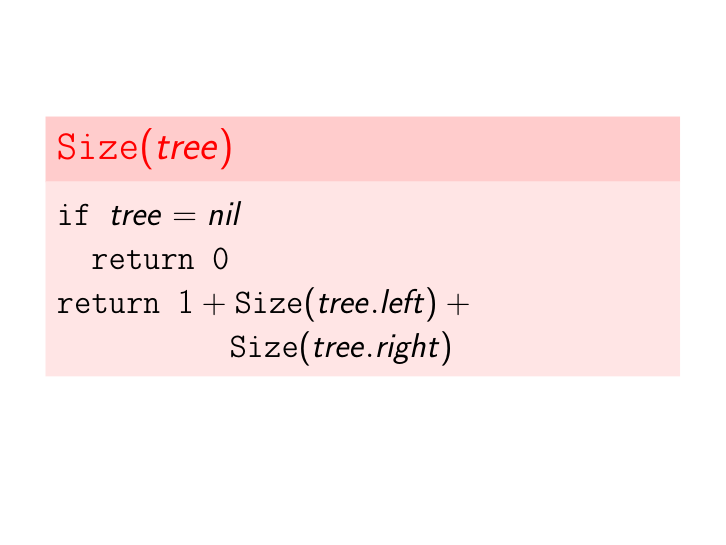

The `1` counts the current node. The two recursive calls count every node in the left and right subtrees. Every node is visited once, so `Size` is `O(n)`.

`Height` also visits every node in the general case, so it is `O(n)`. Both use a recursion stack of `O(h)`, where `h` is the tree height.

## 6. Walking a tree

A traversal visits the nodes in a defined order. The lecture separates two strategies:

- **Depth-first search (DFS)**: completely traverse one subtree before exploring a sibling subtree.
- **Breadth-first search (BFS)**: visit all nodes at one level before moving to the next level.

For binary-tree DFS, the three orders differ only in when the current node is processed relative to its left and right subtrees.

## 7. The traversal example tree

All traversal animations use:

```text
                 Les
              /       \
           Cathy       Sam
          /    \      /   \
       Alex   Frank Nancy Violet
                          /   \
                       Tony   Wendy
```

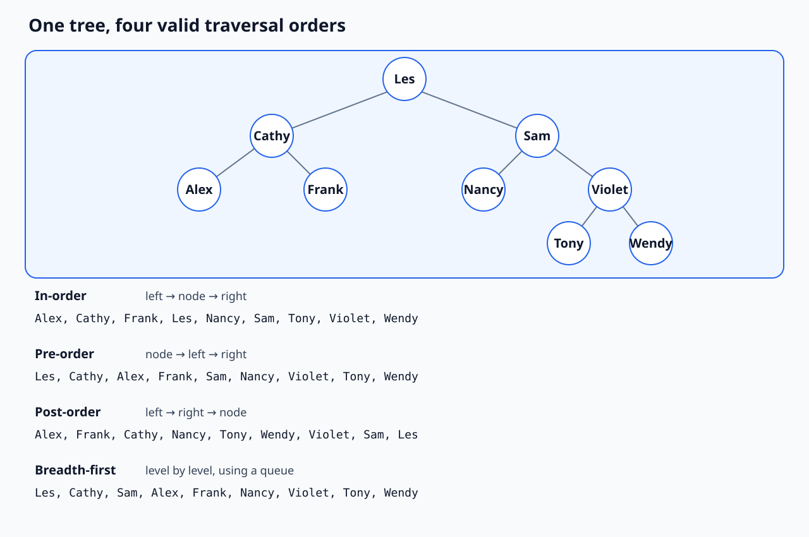

## 8. In-order traversal

In-order visits **left subtree, current node, right subtree**.

```text
InOrderTraversal(tree):
    if tree = nil:
        return
    InOrderTraversal(tree.left)
    Print(tree.key)
    InOrderTraversal(tree.right)
```

For the lecture tree:

```text
Alex, Cathy, Frank, Les, Nancy, Sam, Tony, Violet, Wendy
```


Because the example is a BST, in-order traversal produces keys in sorted order. That sorted-output property depends on the BST invariant; in-order traversal of an arbitrary binary tree is not necessarily sorted.

## 9. Pre-order traversal

Pre-order visits **current node, left subtree, right subtree**.

```text
PreOrderTraversal(tree):
    if tree = nil:
        return
    Print(tree.key)
    PreOrderTraversal(tree.left)
    PreOrderTraversal(tree.right)
```

For the lecture tree:

```text
Les, Cathy, Alex, Frank, Sam, Nancy, Violet, Tony, Wendy
```

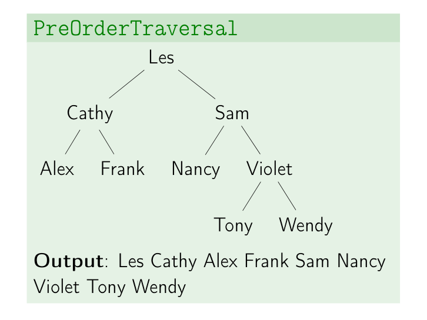

The root appears first. This makes pre-order useful when a parent must be handled before its descendants, for example when serializing a tree with enough null/structure markers.

## 10. Post-order traversal

Post-order visits **left subtree, right subtree, current node**.

```text
PostOrderTraversal(tree):
    if tree = nil:
        return
    PostOrderTraversal(tree.left)
    PostOrderTraversal(tree.right)
    Print(tree.key)
```

For the lecture tree:

```text
Alex, Frank, Cathy, Nancy, Tony, Wendy, Violet, Sam, Les
```

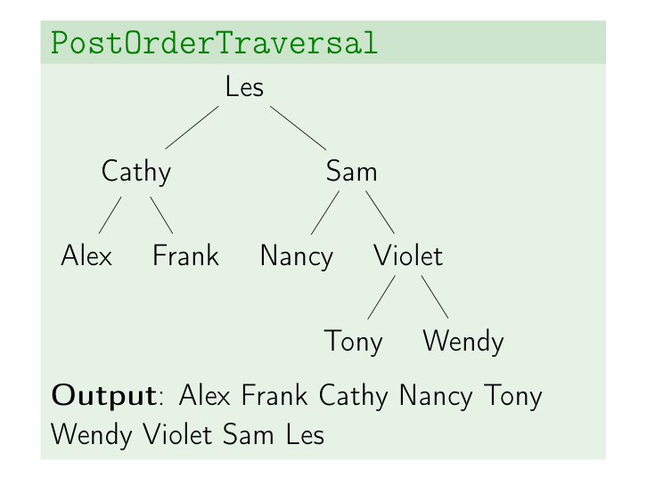

The root appears last. Post-order is useful when children must be processed before their parent, such as calculating directory sizes or deleting an entire tree safely.

## 11. Breadth-first or level-order traversal

BFS uses a queue. The queue stores nodes discovered but not yet processed.

```text
LevelTraversal(tree):
    if tree = nil:
        return

    q <- empty Queue
    q.Enqueue(tree)

    while not q.Empty():
        node <- q.Dequeue()
        Print(node.key)

        if node.left != nil:
            q.Enqueue(node.left)
        if node.right != nil:
            q.Enqueue(node.right)
```

The queue makes parents leave before the children they enqueued, which creates level order.

### 11.1 Queue evolution

Each row shows the queue after the printed node's children have been enqueued.

| Printed node | Output so far | Queue, front to back |
|---|---|---|
| start | empty | `[Les]` |
| `Les` | `Les` | `[Cathy, Sam]` |
| `Cathy` | `Les, Cathy` | `[Sam, Alex, Frank]` |
| `Sam` | `Les, Cathy, Sam` | `[Alex, Frank, Nancy, Violet]` |
| `Alex` | `..., Alex` | `[Frank, Nancy, Violet]` |
| `Frank` | `..., Frank` | `[Nancy, Violet]` |
| `Nancy` | `..., Nancy` | `[Violet]` |
| `Violet` | `..., Violet` | `[Tony, Wendy]` |
| `Tony` | `..., Tony` | `[Wendy]` |
| `Wendy` | `..., Wendy` | `[]` |

The final BFS output is:

```text
Les, Cathy, Sam, Alex, Frank, Nancy, Violet, Tony, Wendy
```

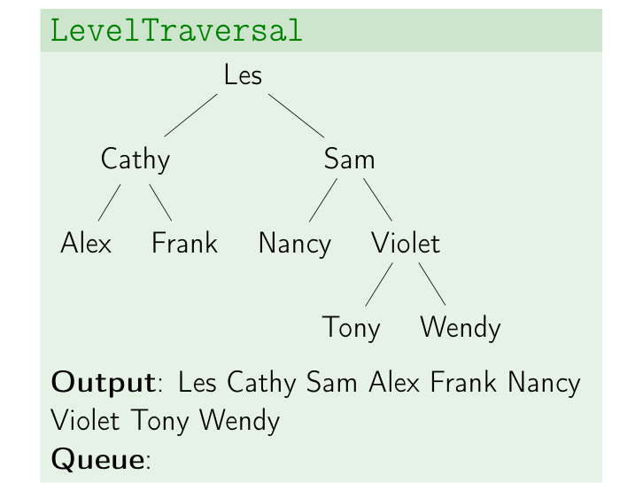

BFS visits every node once, so it takes `O(n)` time. Its queue can contain up to `O(w)` nodes, where `w` is the maximum width of the tree.

## 12. Comparing the walks

| Traversal | Rule | First item | Last item | Typical property |
|---|---|---|---|---|
| In-order | left, node, right | leftmost node | rightmost node | Sorted output for a BST. |
| Pre-order | node, left, right | root | last node in final explored subtree | Parent before descendants. |
| Post-order | left, right, node | first completed leaf | root | Descendants before parent. |
| BFS | level by level | root | deepest rightmost reached node | Shortest number of edges in an unweighted tree/graph search. |

All four traversals take `O(n)` time because each node is processed once. DFS uses recursion or an explicit stack; BFS uses a queue.

## 13. Final traversal quiz

The final slide gives this expression tree:

```text
          +
        /   \
       -     *
      / \   / \
     5   3 6   2
```

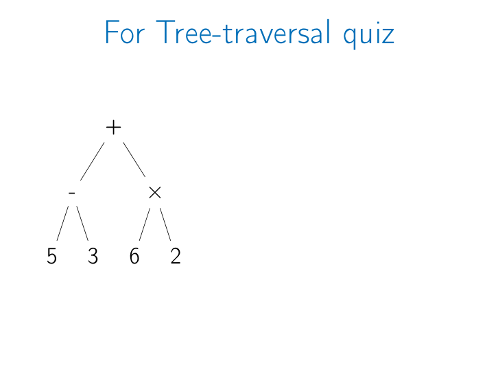

Its traversal orders are:

```text
In-order:    5, -, 3, +, 6, *, 2
Pre-order:   +, -, 5, 3, *, 6, 2
Post-order:  5, 3, -, 6, 2, *, +
BFS:         +, -, *, 5, 3, 6, 2
```

The fully parenthesized expression is `(5 - 3) + (6 * 2)`, which evaluates to `14`. Pre-order is prefix notation; post-order is postfix notation.

## 14. Common mistakes

- Treating every tree as binary. General trees can have any number of children.
- Mixing level and depth conventions. In this lecture the root is level 1.
- Mixing height conventions. Here empty height is 0 and leaf height is 1.
- Omitting the `nil` base case in recursive algorithms, causing invalid access or infinite recursion.
- Memorizing traversal names without locating the node action: before both recursive calls is pre-order, between them is in-order, and after them is post-order.
- Assuming in-order is always sorted. It is sorted only when the tree satisfies the BST ordering invariant.
- Using a stack for BFS. Level order requires FIFO behavior, so use a queue.
- Enqueueing `nil` children in the lecture algorithm. The checks prevent unnecessary entries.

## 15. Quick self-check

1. What are the ancestors of `Tony` in the lecture BST?  
   **Answer:** `Violet`, `Sam`, and `Les`.

2. What are the level and height of `Violet`?  
   **Answer:** Level 3. Height 2 because its farthest leaves, `Tony` and `Wendy`, are one edge or two nodes below including `Violet`.

3. Why does the size formula add both recursive results but height takes their maximum?  
   **Answer:** Size counts every node in both subtrees; height follows only the longer root-to-leaf path.

4. Which traversal prints a BST in sorted order?  
   **Answer:** In-order.

5. What data structure controls BFS's frontier?  
   **Answer:** A FIFO queue.

## 16. Slide coverage map

| Slides | Covered content |
|---|---|
| 1-7 | Lecture title and six applications: sentence syntax, expression, geography, taxonomy, code AST, and BST. |
| 8-9 | Recursive tree definition and empty/one-node/two-node examples. |
| 10-30 | Root, parent, child, ancestor, descendant, sibling, leaf, interior node, level, height, and forest. |
| 31-32 | General-tree and binary-tree node representations. |
| 33-34 | Recursive `Height` and `Size` algorithms. |
| 35-38 | Motivation for tree walks; DFS versus BFS. |
| 39-76 | In-order pseudocode and complete step-by-step animation. |
| 77-114 | Pre-order pseudocode and complete step-by-step animation. |
| 115-152 | Post-order pseudocode and complete step-by-step animation. |
| 153-157 | Queue-based breadth-first pseudocode. |
| 158-186 | Complete BFS output and queue-state animation. |
| 187-191 | Summary: applications, keys/children, DFS/BFS, recursion, and downward drawing convention. |
| 192 | Final expression-tree traversal quiz. |
